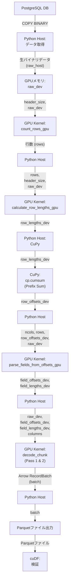

```mermaid
graph TD
    %% ───── メイン処理フロー ─────
    A["PostgreSQL&nbsp;DB"] -->|COPY&nbsp;BINARY| B["Python Host:<br/>データ取得"]
    B -->|"生バイナリデータ<br/>(raw_host)"| C["GPUメモリ:<br/>raw_dev"]

    C -->|"header_size,<br/>raw_dev"| D["GPU Kernel:<br/>count_rows_gpu"]
    D -->|"行数 (rows)"| E["Python Host"]

    E -->|"rows,<br/>header_size,<br/>raw_dev"| F["GPU Kernel:<br/>calculate_row_lengths_gpu"]
    F -->|"row_lengths_dev"| G["Python Host:<br/>CuPy"]

    G -->|row_lengths_dev| H["CuPy:<br/>cp.cumsum<br/>(Prefix Sum)"]
    H -->|"row_offsets_dev"| I["Python Host"]

    I -->|"ncols, rows,<br/>row_offsets_dev,<br/>raw_dev"| J["GPU Kernel:<br/>parse_fields_from_offsets_gpu"]
    J -->|"field_offsets_dev,<br/>field_lengths_dev"| K["Python Host"]

    K -->|"raw_dev,<br/>field_offsets_dev,<br/>field_lengths_dev,<br/>columns"| L["GPU Kernel:<br/>decode_chunk<br/>(Pass 1 & 2)"]
    L -->|"Arrow RecordBatch<br/>(batch)"| M["Python Host"]

    M -->|batch| N["Parquetファイル出力"]
    N -->|"Parquetファイル"| O["cuDF:<br/>検証"]


```