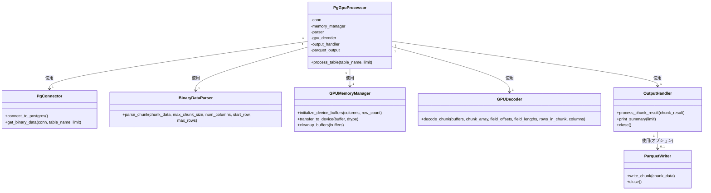

# PostgreSQL GPU Parserの処理フロー

## Parquet出力機能の処理フロー図


## 大規模テーブル処理フロー


## モジュール間の関係図



## 実装別処理フロー比較


## チャンク処理とParquet出力の詳細フロー

```mermaid
sequenceDiagram
    participant Postgres as PostgreSQL
    participant Processor as PgGpuProcessor
    participant Parser as BinaryParser
    participant GPU as GPUDecoder
    participant Output as OutputHandler
    participant Writer as ParquetWriter
    participant PA as PyArrow
    
    Processor->>Postgres: 接続とテーブル情報取得
    Postgres-->>Processor: テーブル情報
    
    Processor->>Postgres: バイナリデータ取得
    Postgres-->>Processor: バイナリデータ
    
    loop チャンク処理
        Processor->>Parser: チャンクパース
        Parser-->>Processor: 解析結果(フィールドオフセット等)
        
        Processor->>GPU: GPUデコード
        GPU-->>Processor: チャンク結果
        
        Processor->>Output: チャンク結果処理
        Output->>Writer: チャンクデータ書き込み
        Writer->>PA: PyArrow Tableに変換
        PA->>Writer: テーブル
        
        alt 最初のチャンク
            Writer->>Writer: 新規ファイル作成
        else 2回目以降
            Writer->>Writer: 追記処理
        end
    end
    
    Processor->>Output: 最終結果処理
    Output->>Writer: クローズ
    
    Processor->>Processor: 結果検証
    Processor-->>PA: Parquetファイル読み込み
    PA-->>Processor: テーブル
