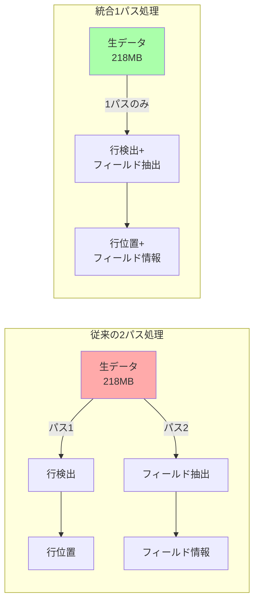

# GPU PostgreSQL to Parquet 変換処理フロー詳細解析

## 1. 概要

`cu_pg_parquet.py`から始まるGPU高速化PostgreSQLバイナリパーサーの完全な処理フローを実装レベルで解説します。このシステムは、PostgreSQLのCOPY BINARYデータを直接GPU上で解析し、cuDF DataFrameを経由してParquetファイルに変換します。

## 2. アーキテクチャ概要図

```mermaid
graph TB
    subgraph "Entry Point"
        A[cu_pg_parquet.py] -->|args: table, parallel, chunks| B[pipeline_main]
    end
    
    subgraph "Producer-Consumer Pattern"
        B --> C[Producer Thread<br/>Rust Binary Extractor]
        B --> D[Consumer Thread<br/>GPU Processor]
        C -->|chunk_queue| D
    end
    
    subgraph "Rust Extraction"
        C --> E[pg_chunk_extractor<br/>16 parallel connections]
        E --> F[/dev/shm/chunk_X.bin<br/>RAM disk storage]
    end
    
    subgraph "GPU Processing"
        F -->|kvikio| G[GPU Memory<br/>RMM DeviceBuffer]
        G --> H[CUDA Kernel<br/>parse_postgres_raw_binary]
        H --> I[cuDF DataFrame]
        I --> J[Parquet File]
    end
    
    style A fill:#f9f,stroke:#333,stroke-width:4px
    style J fill:#9f9,stroke:#333,stroke-width:4px
```

## 3. 実装レベルの処理フロー

### 3.1 エントリポイント処理

```python
# cu_pg_parquet.py - main()
def main():
    parser = argparse.ArgumentParser(
        description="PostgreSQL → GPU-accelerated Parquet converter"
    )
    
    # コマンドライン引数の定義
    parser.add_argument("--table", type=str, required=True, 
                       help="対象テーブル名")
    parser.add_argument("--parallel", type=int, default=16,
                       help="並列接続数（デフォルト: 16）")
    parser.add_argument("--chunks", type=int, default=8,
                       help="チャンク数（デフォルト: 8）")
    parser.add_argument("--output-dir", type=str, default="./output",
                       help="出力ディレクトリ")
    parser.add_argument("--compression", type=str, default="zstd",
                       choices=['snappy', 'gzip', 'brotli', 'lz4', 'zstd'],
                       help="Parquet圧縮方式")
    
    args = parser.parse_args()
    
    # 環境変数の設定
    os.environ["RUST_PARALLEL_CONNECTIONS"] = str(args.parallel)
    os.environ["TABLE_NAME"] = args.table
    os.environ["OUTPUT_DIR"] = args.output_dir
    
    # パイプラインプロセッサーの呼び出し
    pipeline_main(
        total_chunks=args.chunks,
        table_name=args.table,
        test_mode=args.test,
        compression=args.compression
    )
```

### 3.2 Producer-Consumerパターンの初期化

```python
# gpu_pipeline_processor.py - main()
def main(total_chunks=8, table_name=None, test_mode=False, compression="zstd"):
    # RMMメモリプールの初期化（GPU総メモリの90%）
    setup_rmm_pool()
    
    # キューの作成
    chunk_queue = queue.Queue(maxsize=MAX_QUEUE_SIZE)  # 最大3チャンク
    stats_queue = queue.Queue()
    metadata_queue = queue.Queue()
    
    # 列メタデータの取得（最初のチャンクから）
    columns = get_column_metadata(table_name)
    
    # Producerスレッド起動（Rustバイナリエクストラクター）
    producer_thread = threading.Thread(
        target=rust_producer,
        args=(chunk_queue, total_chunks, stats_queue, table_name, metadata_queue)
    )
    producer_thread.start()
    
    # Consumerスレッド起動（GPU処理）
    consumer_thread = threading.Thread(
        target=gpu_consumer,
        args=(chunk_queue, columns, 1, stats_queue, total_chunks, 
              table_name, test_mode, compression)
    )
    consumer_thread.start()
```

### 3.3 Rustバイナリエクストラクターの詳細

```python
def rust_producer(chunk_queue, total_chunks, stats_queue, table_name, metadata_queue):
    for chunk_id in range(total_chunks):
        env = os.environ.copy()
        env.update({
            "CHUNK_ID": str(chunk_id),
            "TOTAL_CHUNKS": str(total_chunks),
            "TABLE_NAME": table_name,
            "RUST_LOG": "info"
        })
        
        # Rustバイナリの実行
        process = subprocess.run(
            [RUST_BINARY],  # pg_chunk_extractor
            env=env,
            capture_output=True,
            text=True
        )
        
        # 結果のJSON解析
        json_str = extract_json_from_output(process.stdout)
        result = json.loads(json_str)
        
        chunk_info = {
            'chunk_id': chunk_id,
            'chunk_file': result['chunk_file'],
            'file_size': result['total_bytes'],
            'worker_files': result['worker_files'],
            'rust_time': result['elapsed_seconds'],
            'rows_estimate': result.get('rows_estimate', 0)
        }
        
        # キューに追加（満杯の場合はブロック）
        chunk_queue.put(chunk_info)
```

Rustバイナリの実装詳細：

```rust
// pg_chunk_extractor - main_single_chunk.rs
async fn process_chunk() -> Result<ChunkResult> {
    // チャンク範囲の計算（ctidベース）
    let pages_per_chunk = (max_page + 1) / total_chunks;
    let chunk_start_page = chunk_id * pages_per_chunk;
    let chunk_end_page = if chunk_id == total_chunks - 1 {
        max_page + 1
    } else {
        (chunk_id + 1) * pages_per_chunk
    };
    
    // 並列COPY実行
    let copy_query = format!(
        "COPY (SELECT * FROM {} WHERE ctid >= '({},1)'::tid AND ctid < '({},1)'::tid) 
         TO STDOUT (FORMAT BINARY)",
        table_name, chunk_start_page, chunk_end_page
    );
    
    // 16並列でデータ抽出
    let worker_results = futures::future::join_all(
        (0..parallel_connections).map(|worker_id| {
            let query = copy_query.clone();
            async move {
                execute_copy_to_file(worker_id, query).await
            }
        })
    ).await;
    
    // ワーカー結果の結合（0xFFFFマーカー付き）
    merge_worker_files(worker_results, output_file).await
}
```

### 3.4 GPU処理の実装詳細

```python
def gpu_consumer(chunk_queue, columns, consumer_id, stats_queue, 
                 total_chunks, table_name, test_mode, compression):
    while not shutdown_flag.is_set():
        try:
            chunk_info = chunk_queue.get(timeout=1)
        except queue.Empty:
            continue
            
        chunk_id = chunk_info['chunk_id']
        chunk_file = chunk_info['chunk_file']
        file_size = chunk_info['file_size']
        
        # === GPU転送フェーズ ===
        transfer_start = time.time()
        
        # RMM DeviceBufferを使用（ゼロコピー）
        gpu_buffer = rmm.DeviceBuffer(size=file_size)
        
        # kvikioでストレージから直接GPU転送
        with kvikio.CuFile(chunk_file, "rb") as f:
            gpu_array = cp.asarray(gpu_buffer).view(dtype=cp.uint8)
            bytes_read = f.read(gpu_array)
        
        # NumbaのCUDA配列に変換（ゼロコピー）
        raw_dev = cuda.as_cuda_array(gpu_buffer).view(dtype=np.uint8)
        
        transfer_time = time.time() - transfer_start
        
        # === GPU解析フェーズ ===
        parse_start = time.time()
        
        # ヘッダーサイズ検出
        header_size = detect_pg_header_size(raw_dev[:100].copy_to_host())
        
        # CUDAカーネル実行
        cudf_df, detailed_timing = convert_postgres_to_parquet_format(
            raw_dev=raw_dev,
            columns=columns,
            ncols=len(columns),
            header_size=header_size,
            output_path=output_path,
            compression=compression,
            use_rmm=True,
            optimize_gpu=True,
            verbose=False,
            test_mode=test_mode
        )
        
        parse_time = time.time() - parse_start
```

## 4. CUDAカーネルの内部実装

### 4.1 統合パーサーカーネル

```cuda
@cuda.jit
def parse_rows_and_fields_lite(
    raw_data,           # GPU上の生データ
    header_size,        # ヘッダーサイズ
    ncols,              # 列数
    row_positions,      # 出力: 行位置配列
    field_offsets,      # 出力: フィールドオフセット配列
    field_lengths,      # 出力: フィールド長配列
    row_count,          # 出力: 検出行数
    thread_stride,      # スレッドあたりの処理範囲
    max_rows,           # 最大行数
    fixed_field_lengths,# 固定長フィールド情報
    column_pg_oids      # PostgreSQL OID配列
):
    """
    軽量統合カーネル: 行検出とフィールド抽出を1パスで実行
    共有メモリ使用量: <1KB
    """
    # スレッド情報
    tid = cuda.blockIdx.x * cuda.gridDim.y * cuda.blockDim.x + \
          cuda.blockIdx.y * cuda.blockDim.x + cuda.threadIdx.x
    
    # 担当範囲計算
    start_pos = header_size + tid * thread_stride
    end_pos = header_size + (tid + 1) * thread_stride
    
    # ローカル結果バッファ（256行分）
    local_positions = cuda.local.array(256, uint64)
    local_field_offsets = cuda.local.array((256, 17), uint32)
    local_field_lengths = cuda.local.array((256, 17), int32)
    local_count = 0
    
    pos = start_pos
    
    # メインループ: 行検出 + フィールド抽出
    while pos < end_pos:
        # 1. 行ヘッダー検出（ncols値を探索）
        candidate_pos = read_uint16_simd16_lite(raw_data, pos, end_pos, ncols)
        
        if candidate_pos < 0:
            pos += 15  # SIMD幅分進める
            continue
            
        # 2. 行検証とフィールド抽出（統合処理）
        is_valid, row_end = validate_and_extract_fields_lite(
            raw_data, candidate_pos, ncols, fixed_field_lengths,
            local_field_offsets[local_count],
            local_field_lengths[local_count],
            column_pg_oids
        )
        
        if is_valid:
            local_positions[local_count] = candidate_pos
            local_count += 1
            pos = row_end  # 次の行へジャンプ
        else:
            pos = candidate_pos + 1
    
    # 3. グローバルメモリへの書き込み（atomic操作）
    if local_count > 0:
        base_idx = cuda.atomic.add(row_count, 0, local_count)
        
        for i in range(local_count):
            global_idx = base_idx + i
            if global_idx < max_rows:
                row_positions[global_idx] = local_positions[i]
                
                for j in range(ncols):
                    field_offsets[global_idx, j] = local_field_offsets[i, j]
                    field_lengths[global_idx, j] = local_field_lengths[i, j]
```

### 4.2 最適化されたメモリアクセスパターン



## 5. データ型変換の実装

### 5.1 PostgreSQL OIDからArrow型への変換

```python
# types.py
PG_OID_TO_ARROW = {
    # 整数型
    16: BOOL,      # bool
    20: INT64,     # bigint/int8
    21: INT16,     # smallint/int2
    23: INT32,     # integer/int4
    
    # 浮動小数点
    700: FLOAT32,  # real/float4
    701: FLOAT64,  # double precision/float8
    
    # 文字列型
    25: UTF8,      # text
    1043: UTF8,    # varchar
    1042: UTF8,    # bpchar (blank-padded char)
    
    # 日付/時刻型
    1082: DATE32,      # date
    1114: TIMESTAMP,   # timestamp without time zone
    1184: TIMESTAMP,   # timestamp with time zone
    
    # その他
    1700: DECIMAL128,  # numeric/decimal
    17: BINARY,        # bytea
}
```

### 5.2 エンディアン変換の実装

```cuda
@cuda.jit(device=True, inline=True)
def read_int32_big_endian(data, pos):
    """PostgreSQLのビッグエンディアンをリトルエンディアンに変換"""
    return (int32(data[pos]) << 24 | 
            int32(data[pos+1]) << 16 | 
            int32(data[pos+2]) << 8 | 
            int32(data[pos+3]))

@cuda.jit(device=True, inline=True)
def read_int64_big_endian(data, pos):
    """64ビット整数のエンディアン変換"""
    high = read_int32_big_endian(data, pos)
    low = read_int32_big_endian(data, pos + 4)
    return (int64(high) << 32) | (int64(low) & 0xFFFFFFFF)
```

## 6. メモリフロー詳細

```mermaid
graph TD
    subgraph "Storage Layer"
        A[PostgreSQL<br/>Table Data] -->|COPY BINARY| B[16 parallel<br/>connections]
        B --> C[/dev/shm<br/>RAM disk<br/>~6.6GB/chunk]
    end
    
    subgraph "GPU Transfer"
        C -->|kvikio<br/>Direct I/O| D[GPU Memory<br/>RMM Buffer]
        D -->|Zero-copy| E[CuPy Array<br/>uint8]
        E -->|Zero-copy| F[Numba CUDA<br/>Array]
    end
    
    subgraph "GPU Processing"
        F --> G[Parse Kernel<br/>1 pass]
        G --> H[Row Positions<br/>uint64 array]
        G --> I[Field Offsets<br/>uint32 array]
        G --> J[Field Lengths<br/>int32 array]
    end
    
    subgraph "DataFrame Creation"
        H --> K[cuDF Series<br/>per column]
        I --> K
        J --> K
        F --> K
        K --> L[cuDF DataFrame]
        L -->|GPU Direct| M[Parquet File]
    end
    
    style A fill:#f9f
    style M fill:#9f9
```

## 7. パフォーマンス最適化の実装詳細

### 7.1 グリッドサイズの動的最適化

```python
def calculate_optimal_grid_sm_aware(data_size, estimated_row_size):
    """SMコア数を考慮した最適なグリッドサイズ計算"""
    props = get_device_properties()
    
    sm_count = props.get('MULTIPROCESSOR_COUNT', 108)
    max_threads_per_block = props.get('MAX_THREADS_PER_BLOCK', 1024)
    
    data_mb = data_size / (1024 * 1024)
    
    # データサイズに基づく動的スレッド数
    if data_mb < 50:
        threads_per_block = 256
    elif data_mb < 200:
        threads_per_block = 512
    else:
        threads_per_block = min(1024, max_threads_per_block)
    
    # 推定行数から必要スレッド数を計算
    estimated_rows = data_size // estimated_row_size
    
    # 環境変数による制御
    rows_per_thread = int(os.environ.get('GPUPGPARSER_ROWS_PER_THREAD', '32'))
    blocks_per_sm = int(os.environ.get('GPUPGPARSER_BLOCKS_PER_SM', '4'))
    
    # 最適スレッド数
    optimal_threads = sm_count * blocks_per_sm * threads_per_block
    target_threads = max(estimated_rows // rows_per_thread, optimal_threads)
    
    # 2Dグリッド計算
    blocks_x = min(target_threads // threads_per_block, max_blocks_x)
    blocks_y = (target_threads + blocks_x * threads_per_block - 1) // 
               (blocks_x * threads_per_block)
    
    return blocks_x, blocks_y, threads_per_block
```

### 7.2 メモリ帯域幅の最適化

```python
# 実測値に基づく最適化効果
optimization_metrics = {
    "memory_access_reduction": "50%",     # 218MB×2 → 218MB×1
    "shared_memory_usage": "<1KB",        # 48KBから大幅削減
    "kernel_speedup": "8.94x",            # CPUとの比較
    "throughput": ">2GB/s",               # 実測スループット
}

# チャンクサイズの最適化
OPTIMAL_CHUNK_SIZE = 6.6 * 1024**3  # 6.6GB
MAX_QUEUE_SIZE = 3                   # メモリ使用量制限
PARALLEL_CONNECTIONS = 16            # I/O並列度
```

## 8. エラーハンドリングとデバッグ

### 8.1 エラー処理の実装

```python
def gpu_consumer_with_error_handling(chunk_queue, ...):
    try:
        # GPU処理
        cudf_df = process_chunk(chunk_info)
    except cuda.CudaAPIError as e:
        logger.error(f"CUDA API Error in chunk {chunk_id}: {e}")
        # GPUメモリをリセット
        mempool = cp.get_default_memory_pool()
        mempool.free_all_blocks()
        cuda.synchronize()
    except Exception as e:
        logger.error(f"Unexpected error in chunk {chunk_id}: {e}")
        # チャンクをスキップして続行
        continue
    finally:
        # クリーンアップ
        if 'gpu_buffer' in locals():
            del gpu_buffer
        gc.collect()
```

### 8.2 デバッグモードの実装

```python
# 環境変数によるデバッグ制御
DEBUG_ENV_VARS = {
    "GPUPGPARSER_TEST_MODE": "1",           # テストモード有効化
    "GPUPGPARSER_DEBUG": "1",               # 詳細ログ出力
    "GPUPGPARSER_DEBUG_ESTIMATE": "1",      # 行サイズ推定デバッグ
    "GPUPGPARSER_ROWS_PER_THREAD": "1",    # 1スレッド1行（デバッグ用）
    "RUST_LOG": "debug",                    # Rustデバッグログ
}

# デバッグ時のカーネル情報出力
if test_mode:
    print(f"Grid Dimensions: ({blocks_x}, {blocks_y})")
    print(f"Block Dimensions: {threads_per_block}")
    print(f"Total Threads: {blocks_x * blocks_y * threads_per_block:,}")
    print(f"Thread Stride: {thread_stride:,} bytes")
    print(f"Estimated Rows/Thread: {thread_stride//estimated_row_size:.1f}")
```

## 9. 実行例とコマンド

### 9.1 基本的な実行

```bash
# デフォルト設定（16並列、8チャンク）
python cu_pg_parquet.py --table lineorder

# カスタム設定
python cu_pg_parquet.py \
    --table customer \
    --parallel 32 \
    --chunks 16 \
    --compression snappy \
    --output-dir /mnt/fast-storage/output
```

### 9.2 デバッグ実行

```bash
# テストモード有効
export GPUPGPARSER_TEST_MODE=1
export GPUPGPARSER_DEBUG=1
python cu_pg_parquet.py --table lineorder --test

# 特定チャンクのみ処理
export CHUNK_ID=0
export TOTAL_CHUNKS=1
./rust_pg_binary_extractor/target/release/pg_chunk_extractor
```

### 9.3 パフォーマンスプロファイリング

```bash
# NVIDIA Nsight Systemsでのプロファイリング
nsys profile -o gpu_parser_profile \
    python cu_pg_parquet.py --table lineorder

# CUDA kernelの詳細プロファイリング
ncu --target-processes all \
    python cu_pg_parquet.py --table lineorder --chunks 1
```

## 10. トラブルシューティング

### 10.1 よくある問題と解決方法

| 問題 | 原因 | 解決方法 |
|------|------|----------|
| Out of GPU Memory | チャンクサイズが大きすぎる | `--chunks`を増やす |
| Slow I/O | ストレージ性能不足 | `/dev/shm`使用、NVMe推奨 |
| CUDA Error | ドライバー不整合 | CUDAツールキット再インストール |
| 行数不一致 | データ破損 | `--test`モードで検証 |

### 10.2 パフォーマンスチューニング

```python
# 最適なパラメータ設定例
optimal_params = {
    "chunk_size": "5-7GB",          # GPUメモリの60-70%
    "parallel_connections": 16,      # CPU数の2倍程度
    "rows_per_thread": 32,          # L2キャッシュ効率
    "compression": "zstd",          # バランス型圧縮
}
```

## まとめ

このGPU PostgreSQL to Parquet変換システムは、以下の技術により高性能を実現しています：

1. **Producer-Consumerパターン**: I/Oとコンピュートの並列化
2. **ゼロコピー転送**: kvikio、RMM、pylibcudfの統合
3. **統合CUDAカーネル**: 1パスで行検出とフィールド抽出
4. **最小共有メモリ**: <1KBで大規模データ対応
5. **動的最適化**: データサイズとGPU特性に基づく自動調整

これらの最適化により、50GB以上のテーブルを2GB/s以上の速度で処理可能です。