# GPU PostgreSQL to Parquet 変換処理フロー詳細解析

## 1. 概要

本ドキュメントは、`cu_pg_parquet.py`から始まるGPU高速化PostgreSQLバイナリパーサーの完全な処理フローを実装レベルで解説します。このシステムは、Producer-Consumerパターンとパイプライン処理を組み合わせ、PostgreSQLのCOPY BINARYデータを高速にParquetファイルに変換します。

## 2. アーキテクチャパターン

### 検出されたパターン

1. **Producer-Consumer Pattern**
   - Producer: Rustバイナリがデータを抽出
   - Queue: サイズ制限付きキュー（バックプレッシャー制御）
   - Consumer: GPU処理スレッドがデータを変換

2. **Pipeline Pattern**
   - 多段階のデータ変換パイプライン
   - 各ステージが独立して動作
   - データストリーミング対応

3. **Parallel Processing Pattern**
   - データソースレベル: 16並列PostgreSQL接続
   - チャンクレベル: 8分割並列処理
   - GPUレベル: 数千スレッドでの並列実行

## 3. システム構成図

```mermaid
graph TB
    %% データフロー全体図

    subgraph DataSource
        direction TB
        %% データソース層
        PG[(PostgreSQL<br/>Table Data<br/>Row-Oriented)]
        COPY[COPY BINARY<br/>Protocol<br/>16 parallel]
        PG -->|SELECT * FROM table| COPY
    end

    subgraph DataExtraction
        direction TB
        %% データ抽出層
        RUST[Rust Extractor<br/>pg_chunk_extractor<br/>High-Performance I/O]
        META[Metadata<br/>Extraction<br/>Column Info]
        COPY -->|Binary Stream| RUST
        RUST -->|First Chunk| META
    end

    subgraph TempStorage
        direction TB
        %% 一時ストレージ層
        SHM1[chunk 0 bin in dev shm<br/>~6.6GB]
        SHM2[chunk 1 bin in dev shm<br/>~6.6GB]
        SHM3[chunk N bin in dev shm<br/>~6.6GB]
        RUST -->|write all at| SHM1
        RUST -->|write all at| SHM2
        RUST -->|write all at| SHM3
    end

    subgraph ProducerThread
        direction TB
        %% プロデューサースレッド
        PRODUCER[rust producer<br/>Subprocess Manager<br/>Queue Controller]
        MONITOR[File Monitor<br/>Size Checker<br/>Completion Detector]
        SHM1 --> MONITOR
        SHM2 --> MONITOR
        SHM3 --> MONITOR
        MONITOR --> PRODUCER
        META --> PRODUCER
    end

    subgraph MessageQueue
        direction TB
        %% メッセージキュー
        QUEUE{{Chunk Queue<br/>maxsize=3<br/>Backpressure Control}}
        PRODUCER -->|put chunk info| QUEUE
    end

    subgraph ConsumerThread
        direction TB
        %% コンシューマースレッド
        CONSUMER[gpu consumer<br/>Chunk Processor<br/>Pipeline Orchestrator]
        QUEUE -->|get with timeout| CONSUMER
    end

    subgraph GPUPipeline
        direction TB
        %% GPUパイプライン
        subgraph Stage1
            direction TB
            %% ステージ1: GPU転送
            KVIKIO[kvikio.CuFile<br/>GPU Direct Storage<br/>Zero-Copy Transfer]
            CONSUMER -->|File Path| KVIKIO
            SHM1 -.->|DMA Transfer| KVIKIO

            GPUMEM1[(GPU Memory<br/>RMM DeviceBuffer<br/>Raw Binary Data)]
            KVIKIO -->|read| GPUMEM1
        end

        subgraph Stage2
            direction TB
            %% ステージ2: 行解析
            DETECT[Header Detection<br/>PGCOPY Signature<br/>19 bytes]
            KERNEL1[parse rows and fields lite<br/>CUDA Kernel<br/>Single Pass]
            GPUMEM1 -->|Validate| DETECT
            DETECT -->|header size| KERNEL1
            GPUMEM1 -->|Read| KERNEL1

            GPUMEM2[(GPU Memory<br/>row positions uint64 array<br/>field offsets uint32 array<br/>field lengths int32 array)]
            KERNEL1 -->|Atomic Write| GPUMEM2
        end

        subgraph Stage3
            direction TB
            %% ステージ3: カラム抽出
            EXTRACT[DirectColumnExtractor<br/>Type-Specific Logic]
            KERNEL2[extract fixed columns<br/>Numeric/Date Types]
            KERNEL3[create string buffers<br/>String/Binary Types]

            GPUMEM2 -->|Indices| EXTRACT
            EXTRACT --> KERNEL2
            EXTRACT --> KERNEL3
            GPUMEM1 -->|Raw Data| KERNEL2
            GPUMEM1 -->|Raw Data| KERNEL3

            GPUMEM3[(GPU Memory<br/>Column Buffers<br/>Type-Specific Arrays<br/>Null Masks)]
            KERNEL2 -->|Direct Write| GPUMEM3
            KERNEL3 -->|Optimized Copy| GPUMEM3
        end

        subgraph Stage4
            direction TB
            %% ステージ4: DataFrame作成
            CUDF[cuDF DataFrame<br/>Zero-Copy Views<br/>Arrow Compatible]
            SERIES[cuDF Series<br/>Per Column<br/>Metadata Attached]
            GPUMEM3 -->|pylibcudf| SERIES
            SERIES -->|Combine| CUDF

            ARROW[(GPU Memory<br/>Arrow Columnar<br/>IPC Format)]
            CUDF -->|Internal Format| ARROW
        end

        subgraph Stage5
            direction TB
            %% ステージ5: Parquet変換
            PARQUET[cuDF.to_parquet<br/>GPU Accelerated<br/>Compression zstd]
            ENCODE[Encoding<br/>Dictionary RLE<br/>Statistics]
            ARROW -->|Column Chunks| ENCODE
            ENCODE --> PARQUET

            GPUMEM4[(GPU Memory<br/>Parquet Buffer<br/>Compressed Data)]
            PARQUET -->|Write Buffer| GPUMEM4
        end
    end

    subgraph OutputLayer
        direction TB
        %% 出力層
        FILE1[chunk 0 parquet<br/>~250MB compressed]
        FILE2[chunk 1 parquet<br/>~250MB compressed]
        FILE3[chunk N parquet<br/>~250MB compressed]
        GPUMEM4 -->|GPU to Host to Disk| FILE1
        GPUMEM4 -->|GPU to Host to Disk| FILE2
        GPUMEM4 -->|GPU to Host to Disk| FILE3
    end

    %% スタイリング
    classDef database fill:#f9f,stroke:#333,stroke-width:3px
    classDef extractor fill:#f96,stroke:#333,stroke-width:2px
    classDef storage fill:#9cf,stroke:#333,stroke-width:2px
    classDef thread fill:#ff9,stroke:#333,stroke-width:2px
    classDef queue fill:#f6f,stroke:#333,stroke-width:3px
    classDef gpu fill:#6f9,stroke:#333,stroke-width:2px
    classDef kernel fill:#9f6,stroke:#333,stroke-width:2px
    classDef memory fill:#cfc,stroke:#333,stroke-width:2px
    classDef output fill:#ccc,stroke:#333,stroke-width:2px

    class PG database
    class RUST,COPY,META extractor
    class SHM1,SHM2,SHM3 storage
    class PRODUCER,CONSUMER,MONITOR thread
    class QUEUE queue
    class KVIKIO,CUDF,PARQUET,SERIES,EXTRACT,ENCODE gpu
    class KERNEL1,KERNEL2,KERNEL3,DETECT kernel
    class GPUMEM1,GPUMEM2,GPUMEM3,GPUMEM4,ARROW memory
    class FILE1,FILE2,FILE3 output
```



## 4. メモリフローとデータ変換詳細

```mermaid
graph LR
    %% メモリ階層とデータ形式変換の詳細

    subgraph DataFormatMemory
        direction LR
        %% データ形式とメモリ階層
        subgraph PostgreSQLFormat
            direction TB
            %% PostgreSQL形式
            PGROW[Row-Oriented Data<br/>Big-Endian<br/>Variable Length<br/>NULL = -1]
            PGPAGE[8KB Pages<br/>Tuple Headers<br/>MVCC Data]
        end

        subgraph CPUMemory
            direction TB
            %% CPUメモリ
            subgraph NetworkBuffer
                direction TB
                %% ネットワークバッファ
                NETBUF[libpq Buffer<br/>64MB Chunks<br/>TCP/IP Stream]
            end

            subgraph CF
                direction TB
                %% COPYフォーマット
                COPYHDR[Header PGCOPY<br/>Flags 4 bytes<br/>Extension 4 bytes]
                COPYROW[Row Format<br/>field count 2B<br/>field length 4B data nB]
            end

            subgraph SM
                direction TB
                %% 共有メモリ
                SHMFILE[dev shm Files<br/>tmpfs Mount<br/>Zero Latency<br/>~6.6GB per chunk]
                MARKERS[Chunk Markers<br/>0xFFFF Boundaries<br/>Worker Separation]
            end
        end

        subgraph GPUMemoryStages
            direction TB
            %% GPUメモリステージ
            subgraph GPUStage1
                direction TB
                %% GPUステージ1: 生データ
                GPURAW[RMM DeviceBuffer<br/>Contiguous Allocation<br/>uint8 array<br/>Size file size]
                DMA[DMA Transfer<br/>PCIe Gen4<br/>~25GB per sec<br/>Bypass CPU]
            end

            subgraph GPUStage2
                direction TB
                %% GPUステージ2: インデックス
                ROWPOS[row positions<br/>dtype uint64<br/>size max rows<br/>~8MB for 1M rows]
                FIELDOFF[field offsets<br/>dtype uint32<br/>shape rows x cols<br/>~100MB for 1M x 25]
                FIELDLEN[field lengths<br/>dtype int32<br/>shape rows x cols<br/>~100MB for 1M x 25]
                PARSEMETA[Parse Metadata<br/>row count int32<br/>error flags int32]
            end

            subgraph GPUStage3
                direction TB
                %% GPUステージ3: カラムバッファ
                FIXCOL[Fixed Columns<br/>int32 int64 float32 float64<br/>date32 timestamp<br/>Direct Endian Convert]
                STROFF[String Offsets<br/>dtype int32<br/>size rows + 1<br/>Cumulative Positions]
                STRDATA[String Data<br/>UTF-8 bytes<br/>Concatenated<br/>No Padding]
                DECCOL[Decimal Columns<br/>int128 representation<br/>Precision Scale preserved]
                NULLMASK[Null Bitmasks<br/>1 bit per value<br/>Arrow Compatible<br/>Byte Aligned]
            end

            subgraph GPUStage4
                direction TB
                %% GPUステージ4: Arrow形式
                ARROWBUF[Arrow Buffers<br/>IPC Specification<br/>64-byte Aligned<br/>Zero-Copy Views]
                ARROWMETA[Schema Metadata<br/>Field Names Types<br/>Encoding Info<br/>Statistics]
            end

            subgraph GPUStage5
                direction TB
                %% GPUステージ5: Parquet形式
                PAGEHDR[Page Headers<br/>Compression Info<br/>Encoding Type<br/>CRC Checksums]
                COLCHUNK[Column Chunks<br/>Row Group Size<br/>Dictionary Pages<br/>Data Pages]
                FILEMETA[File Metadata<br/>Schema Definition<br/>Row Group Info<br/>Key Value Pairs]
            end
        end
    end

    %% データフロー
    PGROW -->|COPY TO| PGPAGE
    PGPAGE -->|Network| NETBUF
    NETBUF -->|Parse| COPYHDR
    NETBUF -->|Parse| COPYROW
    COPYHDR -->|Write| SHMFILE
    COPYROW -->|Write| SHMFILE
    COPYROW -->|Marker| MARKERS

    SHMFILE -->|kvikio| DMA
    MARKERS -->|kvikio| DMA
    DMA -->|Transfer| GPURAW

    GPURAW -->|parse kernel| ROWPOS
    GPURAW -->|parse kernel| FIELDOFF
    GPURAW -->|parse kernel| FIELDLEN
    GPURAW -->|parse kernel| PARSEMETA

    ROWPOS -->|extract| FIXCOL
    FIELDOFF -->|extract| FIXCOL
    FIELDLEN -->|extract| FIXCOL
    GPURAW -->|copy| FIXCOL

    ROWPOS -->|extract| STROFF
    FIELDOFF -->|extract| STROFF
    FIELDLEN -->|extract| STRDATA
    GPURAW -->|copy| STRDATA

    FIELDLEN -->|check -1| NULLMASK
    GPURAW -->|decimal| DECCOL

    FIXCOL -->|view| ARROWBUF
    STROFF -->|view| ARROWBUF
    STRDATA -->|view| ARROWBUF
    DECCOL -->|view| ARROWBUF
    NULLMASK -->|attach| ARROWBUF
    ARROWBUF -->|metadata| ARROWMETA

    ARROWBUF -->|encode| COLCHUNK
    ARROWMETA -->|write| FILEMETA
    COLCHUNK -->|compress| PAGEHDR

    %% メモリサイズ注釈
    GPURAW -.->|500MB per chunk| GPURAW
    ROWPOS -.->|~8MB| ROWPOS
    FIELDOFF -.->|~100MB| FIELDOFF
    FIXCOL -.->|~200MB| FIXCOL
    STRDATA -.->|~150MB| STRDATA
    COLCHUNK -.->|~250MB compressed| COLCHUNK

    %% スタイリング
    classDef postgres fill:#f9f,stroke:#333,stroke-width:2px
    classDef cpu fill:#9cf,stroke:#333,stroke-width:2px
    classDef transfer fill:#f96,stroke:#333,stroke-width:2px
    classDef gpu1 fill:#ff9,stroke:#333,stroke-width:2px
    classDef gpu2 fill:#f93,stroke:#333,stroke-width:2px
    classDef gpu3 fill:#6f9,stroke:#333,stroke-width:2px
    classDef gpu4 fill:#9f6,stroke:#333,stroke-width:2px
    classDef gpu5 fill:#cfc,stroke:#333,stroke-width:2px

    class PGROW,PGPAGE postgres
    class NETBUF,COPYHDR,COPYROW,SHMFILE,MARKERS cpu
    class DMA,GPURAW transfer
    class ROWPOS,FIELDOFF,FIELDLEN,PARSEMETA gpu1
    class FIXCOL,STROFF,STRDATA,DECCOL,NULLMASK gpu2
    class ARROWBUF,ARROWMETA gpu3
    class PAGEHDR,COLCHUNK,FILEMETA gpu4
```



## 5. 実装詳細

### 5.1 エントリポイント: cu_pg_parquet.py

```python
def main():
    """メインエントリポイント"""
    parser = argparse.ArgumentParser(
        description="PostgreSQL → GPU-accelerated Parquet converter",
        formatter_class=argparse.RawDescriptionHelpFormatter
    )

    # コマンドライン引数
    parser.add_argument("--table", type=str, required=True, help="対象テーブル名")
    parser.add_argument("--parallel", type=int, default=16, help="並列接続数")
    parser.add_argument("--chunks", type=int, default=8, help="チャンク数")
    parser.add_argument("--output-dir", type=str, default="./output")
    parser.add_argument("--compression", type=str, default="zstd",
                       choices=['snappy', 'gzip', 'brotli', 'lz4', 'zstd'])

    args = parser.parse_args()

    # 環境変数設定
    os.environ["RUST_PARALLEL_CONNECTIONS"] = str(args.parallel)
    os.environ["TABLE_NAME"] = args.table
    os.environ["OUTPUT_DIR"] = args.output_dir
    os.environ["GPUPASER_PG_DSN"] = os.environ.get(
        "GPUPASER_PG_DSN",
        "dbname=postgres user=postgres host=localhost port=5432"
    )

    # 既存ファイルのクリーンアップ
    cleanup_existing_files(args.table, args.output_dir)

    # パイプライン実行
    pipeline_main(
        total_chunks=args.chunks,
        table_name=args.table,
        test_mode=args.test,
        compression=args.compression
    )
```

### 5.2 Producer-Consumer実装: gpu_pipeline_processor.py

```python
def main(total_chunks=8, table_name=None, test_mode=False, compression="zstd"):
    """Producer-Consumerパイプラインのメイン処理"""

    # RMMメモリプール初期化（GPU総メモリの90%）
    setup_rmm_pool()

    # キューとスレッド管理
    chunk_queue = queue.Queue(maxsize=MAX_QUEUE_SIZE)  # バックプレッシャー制御
    stats_queue = queue.Queue()
    metadata_queue = queue.Queue()
    shutdown_flag = threading.Event()

    # シグナルハンドラー設定
    signal.signal(signal.SIGINT, lambda s, f: handle_shutdown(shutdown_flag))

    # 列メタデータ取得（最初のチャンクから）
    columns = get_column_metadata(table_name, metadata_queue)

    # Producer Thread起動
    producer_thread = threading.Thread(
        target=rust_producer,
        args=(chunk_queue, total_chunks, stats_queue, table_name, metadata_queue),
        name="RustProducer"
    )
    producer_thread.start()

    # Consumer Thread起動
    consumer_thread = threading.Thread(
        target=gpu_consumer,
        args=(chunk_queue, columns, 1, stats_queue, total_chunks,
              table_name, test_mode, compression),
        name="GPUConsumer-1"
    )
    consumer_thread.start()

    # スレッド終了待機
    producer_thread.join()
    consumer_thread.join()
```

#### Producer実装

```python
def rust_producer(chunk_queue, total_chunks, stats_queue, table_name, metadata_queue):
    """Rustバイナリを実行してデータを抽出"""
    for chunk_id in range(total_chunks):
        if shutdown_flag.is_set():
            break

        # 環境変数設定
        env = os.environ.copy()
        env.update({
            "CHUNK_ID": str(chunk_id),
            "TOTAL_CHUNKS": str(total_chunks),
            "TABLE_NAME": table_name,
            "RUST_LOG": "info"
        })

        # Rustバイナリ実行
        start_time = time.time()
        process = subprocess.run(
            [RUST_BINARY],
            env=env,
            capture_output=True,
            text=True
        )

        if process.returncode == 0:
            # JSON結果解析
            json_str = extract_json_from_output(process.stdout)
            result = json.loads(json_str)

            chunk_info = {
                'chunk_id': chunk_id,
                'chunk_file': result['chunk_file'],
                'file_size': result['total_bytes'],
                'worker_files': result['worker_files'],
                'rust_time': result['elapsed_seconds'],
                'rows_estimate': result.get('rows_estimate', 0)
            }

            # メタデータ保存（最初のチャンクのみ）
            if chunk_id == 0 and 'columns' in result:
                metadata_queue.put(result['columns'])

            # キューに追加（満杯時はブロック）
            chunk_queue.put(chunk_info)

    # 終了シグナル
    chunk_queue.put(None)
```

#### Consumer実装

```python
def gpu_consumer(chunk_queue, columns, consumer_id, stats_queue,
                 total_chunks, table_name, test_mode, compression):
    """GPUでチャンクを処理"""

    processed_chunks = 0

    while not shutdown_flag.is_set():
        try:
            # チャンク情報取得（タイムアウト付き）
            chunk_info = chunk_queue.get(timeout=1)

            if chunk_info is None:  # 終了シグナル
                break

        except queue.Empty:
            continue

        chunk_id = chunk_info['chunk_id']
        chunk_file = chunk_info['chunk_file']
        file_size = chunk_info['file_size']

        # === フェーズ1: GPU転送 ===
        transfer_start = time.time()

        # RMM DeviceBuffer確保
        gpu_buffer = rmm.DeviceBuffer(size=file_size)

        # kvikioで直接GPU転送
        with kvikio.CuFile(chunk_file, "rb") as f:
            gpu_array = cp.asarray(gpu_buffer).view(dtype=cp.uint8)
            bytes_read = f.read(gpu_array)

        # Numba CUDA配列に変換（ゼロコピー）
        raw_dev = cuda.as_cuda_array(gpu_buffer).view(dtype=np.uint8)

        transfer_time = time.time() - transfer_start

        # === フェーズ2: ヘッダー検出 ===
        header_start = time.time()
        header_size = detect_pg_header_size(raw_dev[:100].copy_to_host())
        header_time = time.time() - header_start

        # === フェーズ3: GPU解析とParquet変換 ===
        parse_start = time.time()

        output_path = f"{OUTPUT_DIR}/{table_name}_chunk_{chunk_id}.parquet"

        cudf_df, detailed_timing = convert_postgres_to_parquet_format(
            raw_dev=raw_dev,
            columns=columns,
            ncols=len(columns),
            header_size=header_size,
            output_path=output_path,
            compression=compression,
            use_rmm=True,
            optimize_gpu=True,
            verbose=False,
            test_mode=test_mode
        )

        parse_time = time.time() - parse_start
        gpu_row_count = len(cudf_df)

        # === フェーズ4: クリーンアップ ===
        cleanup_start = time.time()

        # メモリ解放
        del raw_dev, gpu_buffer, gpu_array, cudf_df
        mempool = cp.get_default_memory_pool()
        mempool.free_all_blocks()
        gc.collect()
        cuda.synchronize()

        # 一時ファイル削除
        try:
            os.remove(chunk_file)
            for worker_file in chunk_info.get('worker_files', []):
                if os.path.exists(worker_file):
                    os.remove(worker_file)
        except Exception as e:
            logger.warning(f"ファイル削除エラー: {e}")

        cleanup_time = time.time() - cleanup_start

        # 統計情報記録
        chunk_stats = {
            'chunk_id': chunk_id,
            'transfer_time': transfer_time,
            'parse_time': parse_time,
            'cleanup_time': cleanup_time,
            'gpu_rows': gpu_row_count,
            'file_size_mb': file_size / (1024 * 1024)
        }
        stats_queue.put(chunk_stats)

        processed_chunks += 1
```

### 5.3 Rustデータ抽出: pg_chunk_extractor

```rust
#[tokio::main]
async fn main() -> Result<(), Box<dyn std::error::Error>> {
    // 環境変数から設定取得
    let chunk_id: usize = env::var("CHUNK_ID")?.parse()?;
    let total_chunks: usize = env::var("TOTAL_CHUNKS")?.parse()?;
    let table_name = env::var("TABLE_NAME")?;
    let parallel_connections: usize = env::var("RUST_PARALLEL_CONNECTIONS")
        .unwrap_or_else(|_| "16".to_string())
        .parse()?;

    // PostgreSQL接続
    let dsn = env::var("GPUPASER_PG_DSN")?;
    let (client, connection) = tokio_postgres::connect(&dsn, NoTls).await?;

    // 最大ページ数取得
    let max_page = get_max_page(&client, &table_name).await?;
    let pages_per_chunk = (max_page + 1) / total_chunks;

    // チャンク範囲計算
    let chunk_start_page = chunk_id * pages_per_chunk;
    let chunk_end_page = if chunk_id == total_chunks - 1 {
        max_page + 1
    } else {
        (chunk_id + 1) * pages_per_chunk
    };

    // 出力ファイル準備
    let output_file = format!("/dev/shm/{}_chunk_{}.bin", table_name, chunk_id);
    let file = tokio::fs::OpenOptions::new()
        .create(true)
        .write(true)
        .truncate(true)
        .open(&output_file)
        .await?;

    // 並列COPY実行
    let chunk_pages = chunk_end_page - chunk_start_page;
    let pages_per_worker = chunk_pages / parallel_connections;

    let mut handles = vec![];
    let mut worker_files = vec![];

    for worker_id in 0..parallel_connections {
        let worker_start = chunk_start_page + worker_id * pages_per_worker;
        let worker_end = if worker_id == parallel_connections - 1 {
            chunk_end_page
        } else {
            chunk_start_page + (worker_id + 1) * pages_per_worker
        };

        let worker_file = format!("/dev/shm/{}_chunk_{}_worker_{}.bin",
                                 table_name, chunk_id, worker_id);
        worker_files.push(worker_file.clone());

        // ワーカースレッド起動
        let handle = tokio::spawn(async move {
            extract_worker(
                &dsn,
                &table_name,
                worker_start,
                worker_end,
                &worker_file
            ).await
        });
        handles.push(handle);
    }

    // 全ワーカー完了待機
    let mut total_bytes = 0u64;
    for handle in handles {
        let bytes = handle.await??;
        total_bytes += bytes;
    }

    // ワーカーファイル結合（0xFFFFマーカー付き）
    merge_worker_files(&worker_files, &output_file).await?;

    // メタデータ取得（最初のチャンクのみ）
    let columns = if chunk_id == 0 {
        Some(get_column_metadata(&client, &table_name).await?)
    } else {
        None
    };

    // 結果JSON出力
    let result = json!({
        "chunk_id": chunk_id,
        "chunk_file": output_file,
        "worker_files": worker_files,
        "total_bytes": total_bytes,
        "pages": chunk_end_page - chunk_start_page,
        "columns": columns,
        "elapsed_seconds": start.elapsed().as_secs_f64()
    });

    println!("{}", serde_json::to_string(&result)?);
    Ok(())
}

async fn extract_worker(
    dsn: &str,
    table_name: &str,
    start_page: usize,
    end_page: usize,
    output_file: &str
) -> Result<u64, Box<dyn std::error::Error>> {
    // PostgreSQL接続
    let (client, connection) = tokio_postgres::connect(dsn, NoTls).await?;
    tokio::spawn(connection);

    // COPY実行
    let copy_query = format!(
        "COPY (SELECT * FROM {} WHERE ctid >= '({},1)'::tid AND ctid < '({},1)'::tid)
         TO STDOUT (FORMAT BINARY)",
        table_name, start_page, end_page
    );

    let copy_stream = client.copy_out(&copy_query).await?;
    let mut reader = pin!(copy_stream);

    // ファイル書き込み
    let file = tokio::fs::OpenOptions::new()
        .create(true)
        .write(true)
        .truncate(true)
        .open(output_file)
        .await?;

    let mut writer = BufWriter::with_capacity(64 * 1024 * 1024, file);
    let mut total_bytes = 0u64;

    // ストリーミング転送
    while let Some(chunk) = reader.try_next().await? {
        writer.write_all(&chunk).await?;
        total_bytes += chunk.len() as u64;
    }

    writer.flush().await?;
    Ok(total_bytes)
}
```

### 5.4 CUDAカーネル実装: parse_rows_and_fields_lite

```cuda
@cuda.jit
def parse_rows_and_fields_lite(
    raw_data,           # GPU上の生データ
    header_size,        # ヘッダーサイズ（通常19バイト）
    ncols,              # 列数
    row_positions,      # 出力: 行開始位置（uint64配列）
    field_offsets,      # 出力: フィールドオフセット（uint32配列）
    field_lengths,      # 出力: フィールド長（int32配列）
    row_count,          # 出力: 検出行数（atomic更新）
    thread_stride,      # スレッドあたりの処理範囲
    max_rows,           # 最大行数
    fixed_field_lengths,# 固定長フィールド情報
    column_pg_oids      # PostgreSQL OID配列
):
    """
    統合パーサーカーネル: 行検出とフィールド抽出を1パスで実行

    最適化ポイント:
    - 共有メモリ使用量: <5KB（48KB制限内）
    - メモリアクセス: 1回のみ（従来は2回）
    - アトミック操作: 出力調整のみ
    - ローカルバッファ: 256行分（L1キャッシュ活用）
    """

    # === スレッド情報計算 ===
    tid = cuda.blockIdx.x * cuda.gridDim.y * cuda.blockDim.x + \
          cuda.blockIdx.y * cuda.blockDim.x + cuda.threadIdx.x
    local_tid = cuda.threadIdx.x

    # 最小限の共有メモリ（ブロック内カウンタのみ）
    block_count = cuda.shared.array(1, int32)
    if local_tid == 0:
        block_count[0] = 0
    cuda.syncthreads()

    # === 処理範囲計算 ===
    start_pos = uint64(header_size + tid * thread_stride)
    end_pos = uint64(header_size + (tid + 1) * thread_stride)

    if start_pos >= raw_data.size:
        return

    # === ローカル結果バッファ ===
    # L1キャッシュに収まるサイズで高速アクセス
    local_positions = cuda.local.array(256, uint64)
    local_field_offsets = cuda.local.array((256, 17), uint32)  # 最大17列対応
    local_field_lengths = cuda.local.array((256, 17), int32)
    local_count = 0

    pos = uint64(start_pos)

    # === メインループ: 行検出 + フィールド抽出統合 ===
    while pos < end_pos and local_count < 256:

        # === フェーズ1: 行ヘッダー検出（SIMD風探索） ===
        candidate_pos = read_uint16_simd16_lite(raw_data, pos, end_pos, ncols)

        if candidate_pos < 0:  # ヘッダー未発見
            if candidate_pos == -1:  # 通常の未発見
                pos += 15  # SIMD幅-1
            else:  # データ終端
                break
            continue

        # === フェーズ2: 行検証 + フィールド抽出（統合実行） ===
        is_valid, row_end = validate_and_extract_fields_lite(
            raw_data, uint64(candidate_pos), ncols, fixed_field_lengths,
            local_field_offsets[local_count],  # 直接ローカルバッファに書き込み
            local_field_lengths[local_count],
            column_pg_oids
        )

        if is_valid:
            # 有効な行を記録
            local_positions[local_count] = uint64(candidate_pos)
            local_count += 1

            # 次の行へ効率的にジャンプ
            pos = row_end if row_end > 0 else uint64(candidate_pos + 1)
        else:
            # 無効な場合は1バイト進める
            pos = uint64(candidate_pos + 1)

    # === フェーズ3: グローバルメモリへの一括書き込み ===
    if local_count > 0:
        # アトミック操作で出力位置を確保
        base_idx = cuda.atomic.add(row_count, 0, local_count)

        # ローカルバッファからグローバルメモリへコピー
        for i in range(local_count):
            global_idx = base_idx + i
            if global_idx < max_rows:
                # 行位置
                row_positions[global_idx] = local_positions[i]

                # フィールド情報（相対オフセット使用でメモリ節約）
                for j in range(min(ncols, 17)):
                    field_offsets[global_idx, j] = local_field_offsets[i, j]
                    field_lengths[global_idx, j] = local_field_lengths[i, j]

@cuda.jit(device=True, inline=True)
def read_uint16_simd16_lite(raw_data, pos, end_pos, expected_value):
    """
    16バイト先読みによる高速ヘッダー検出

    SIMD風の並列探索でフィールド数を検出
    """
    if pos + 1 > raw_data.size:
        return int64(-2)  # データ終端

    # 最大16バイト先読み（メモリアライメント考慮）
    max_offset = min(16, int32(raw_data.size - pos + 1))

    for i in range(0, max_offset, 2):  # 2バイト単位でチェック
        if pos + i + 1 > end_pos:
            return int64(-3)  # 範囲外

        idx = uint64(pos + i)

        # ビッグエンディアン16ビット読み取り
        num_fields = (raw_data[idx] << 8) | raw_data[idx + 1]

        if num_fields == expected_value:
            return int64(pos + i)  # 発見位置を返す

    return int64(-1)  # 未発見

@cuda.jit(device=True, inline=True)
def validate_and_extract_fields_lite(
    raw_data, row_start, expected_cols, fixed_field_lengths,
    field_offsets_out,  # 出力: 相対オフセット配列
    field_lengths_out,  # 出力: フィールド長配列
    column_pg_oids      # PostgreSQL型OID配列
):
    """
    行検証とフィールド情報抽出を統合

    戻り値: (is_valid, row_end_position)
    """
    if row_start + 2 > raw_data.size:
        return False, -1

    # フィールド数確認
    row_start_idx = uint64(row_start)
    num_fields = (raw_data[row_start_idx] << 8) | raw_data[row_start_idx + 1]

    if num_fields != expected_cols:
        return False, -2

    pos = uint64(row_start + 2)

    # 各フィールドを検証しながら情報を抽出
    for field_idx in range(num_fields):
        if pos + 4 > raw_data.size:
            return False, -3

        # フィールド長読み取り（ビッグエンディアン32ビット）
        pos_idx = uint64(pos)
        flen = (int32(raw_data[pos_idx]) << 24 |
                int32(raw_data[pos_idx+1]) << 16 |
                int32(raw_data[pos_idx+2]) << 8 |
                int32(raw_data[pos_idx+3]))

        # フィールド情報を即座に記録（相対オフセット使用）
        relative_offset = uint32((pos + 4) - row_start)
        field_offsets_out[field_idx] = relative_offset
        field_lengths_out[field_idx] = flen

        if flen == -1:  # NULL値
            pos += 4
        else:
            # 妥当性チェック
            if flen < 0 or flen > 1000000:  # 1MB以上は異常
                return False, -4

            # 固定長フィールドの検証
            if (field_idx < expected_cols and
                fixed_field_lengths[field_idx] > 0 and
                flen != fixed_field_lengths[field_idx]):
                return False, -5

            # データ境界チェック
            if pos + 4 + flen > raw_data.size:
                return False, -6

            # numeric型（OID=1700）の追加検証
            if (field_idx < expected_cols and
                column_pg_oids[field_idx] == 1700 and
                flen >= 8):
                if not is_valid_decimal_header(raw_data, pos + 4, flen):
                    return False, -7

            pos += uint64(4 + flen)

    # 次の行ヘッダーの妥当性確認（オプション）
    if pos + 2 <= raw_data.size:
        pos_idx2 = uint64(pos)
        next_header = (raw_data[pos_idx2] << 8) | raw_data[pos_idx2 + 1]

        # 次も同じ列数か、終端マーカー（0xFFFF）であるべき
        if next_header != expected_cols and next_header != 0xFFFF:
            return False, -8

    return True, pos  # 成功: 行終端位置を返す
```

### 5.5 カラム抽出実装: DirectColumnExtractor

```python
class DirectColumnExtractor:
    """統合バッファを使わない直接カラム抽出"""

    def extract_columns_direct(
        self, raw_dev, row_positions_dev, field_offsets_dev,
        field_lengths_dev, columns, string_buffers,
        thread_ids_dev=None, thread_start_positions_dev=None,
        thread_end_positions_dev=None
    ):
        """入力データから直接cuDF列を作成"""

        rows = field_offsets_dev.shape[0]
        cudf_columns = {}

        for col_idx, col in enumerate(columns):
            if col.is_variable and col.arrow_id in (UTF8, BINARY):
                # 文字列カラム: 最適化バッファ使用
                series = self._create_string_series_from_buffer(
                    col, rows, string_buffers[col.name]
                )
            else:
                # 固定長カラム: 直接抽出
                series = self._extract_fixed_column_direct(
                    raw_dev, row_positions_dev, field_offsets_dev,
                    field_lengths_dev, col, col_idx, rows
                )

            cudf_columns[col.name] = series

        # デバッグ列の追加（テストモード時）
        if thread_ids_dev is not None:
            cudf_columns['_thread_id'] = self._create_debug_column(
                thread_ids_dev[:rows], "thread_id"
            )

        return cudf.DataFrame(cudf_columns)

    def _extract_fixed_column_direct(
        self, raw_dev, row_positions_dev, field_offsets_dev,
        field_lengths_dev, col, col_idx, rows
    ):
        """固定長カラムの直接抽出（ゼロコピー）"""

        # デバイスバッファ確保
        if col.arrow_id == DECIMAL128:
            # Decimal128は特殊処理
            buffer_size = rows * 16  # 128ビット
            device_buffer = rmm.DeviceBuffer(size=buffer_size)

            # カーネル実行
            blocks, threads = self._calculate_grid(rows)
            extract_decimal_column_direct[blocks, threads](
                raw_dev, row_positions_dev, field_offsets_dev[:, col_idx],
                field_lengths_dev[:, col_idx], device_buffer,
                rows, col.precision, col.scale
            )

            # pylibcudfで列作成
            return create_decimal128_series(
                device_buffer, rows, col.precision, col.scale
            )

        else:
            # 通常の固定長型
            dtype = ARROW_TO_NUMPY.get(col.arrow_id, np.int32)
            buffer_size = rows * np.dtype(dtype).itemsize
            device_buffer = rmm.DeviceBuffer(size=buffer_size)

            # エンディアン変換込みの抽出
            blocks, threads = self._calculate_grid(rows)
            extract_fixed_type_with_endian[blocks, threads](
                raw_dev, row_positions_dev, field_offsets_dev[:, col_idx],
                field_lengths_dev[:, col_idx], device_buffer,
                rows, col.pg_oid, dtype.itemsize
            )

            # cuDF Series作成（ゼロコピー）
            data = as_column(
                DeviceBuffer(ptr=device_buffer.ptr, size=buffer_size),
                dtype=dtype
            )

            # NULL処理
            null_count = count_nulls(field_lengths_dev[:, col_idx])
            if null_count > 0:
                mask = create_null_mask(field_lengths_dev[:, col_idx], rows)
                data = data.set_mask(mask)

            return cudf.Series(data, name=col.name)

    def create_string_buffers(
        self, columns, rows, raw_dev, row_positions_dev,
        field_offsets_dev, field_lengths_dev
    ):
        """文字列カラム用の最適化バッファ作成"""

        string_buffers = {}

        for col_idx, col in enumerate(columns):
            if not (col.is_variable and col.arrow_id in (UTF8, BINARY)):
                continue

            # === フェーズ1: オフセット計算 ===
            # NULL以外の文字列長を累積
            offsets_array = rmm.DeviceBuffer(size=(rows + 1) * 4)

            blocks, threads = self._calculate_grid(rows)
            compute_string_offsets[blocks, threads](
                field_lengths_dev[:, col_idx],
                offsets_array,
                rows
            )

            # 総バイト数取得
            total_bytes = int(offsets_array.copy_to_host()[-4:].view(np.int32)[0])

            if total_bytes == 0:
                # 全てNULLの場合
                string_buffers[col.name] = {
                    'offsets': offsets_array,
                    'data': rmm.DeviceBuffer(size=1),
                    'null_mask': create_null_mask(field_lengths_dev[:, col_idx], rows)
                }
                continue

            # === フェーズ2: 文字列データコピー ===
            data_buffer = rmm.DeviceBuffer(size=total_bytes)

            # 最適化: 大きなブロックで並列コピー
            copy_threads = min(512, threads)
            copy_blocks = (rows + copy_threads - 1) // copy_threads

            copy_string_data_optimized[copy_blocks, copy_threads](
                raw_dev, row_positions_dev, field_offsets_dev[:, col_idx],
                field_lengths_dev[:, col_idx], offsets_array,
                data_buffer, rows
            )

            # === フェーズ3: NULL処理 ===
            null_count = count_nulls(field_lengths_dev[:, col_idx])
            null_mask = None
            if null_count > 0:
                null_mask = create_null_mask(field_lengths_dev[:, col_idx], rows)

            string_buffers[col.name] = {
                'offsets': offsets_array,
                'data': data_buffer,
                'null_mask': null_mask,
                'null_count': null_count
            }

        return string_buffers
```

### 5.6 Parquet書き込み最適化

```python
def write_cudf_to_parquet_with_options(
    df: cudf.DataFrame,
    output_path: str,
    compression: str = 'zstd',
    optimize_for_spark: bool = True,
    **kwargs
) -> Dict[str, float]:
    """GPU最適化Parquet書き込み"""

    timing = {}
    start_time = time.time()

    # Parquetオプション設定
    parquet_options = {
        'compression': compression,
        'row_group_size': 100000,  # Spark最適化
        'use_dictionary': True,
        'dictionary_pagesize_limit': 1024 * 1024,
        'data_pagesize_limit': 1024 * 1024,
        'write_statistics': True,
    }

    # カスタムオプションのマージ
    parquet_options.update(kwargs)

    # メタデータ準備
    if optimize_for_spark:
        # Sparkとの互換性のためのメタデータ
        parquet_options['metadata'] = {
            'created_by': 'gpupgparser',
            'spark.sql.parquet.compression.codec': compression
        }

    # GPU上でParquet書き込み
    write_start = time.time()
    df.to_parquet(
        output_path,
        engine='cudf',  # GPU実装を使用
        **parquet_options
    )
    timing['parquet_write'] = time.time() - write_start

    # ファイルサイズ確認
    file_size = os.path.getsize(output_path)
    timing['file_size_mb'] = file_size / (1024 * 1024)
    timing['total'] = time.time() - start_time

    return timing
```

## 6. パフォーマンス最適化の実装詳細

### 6.1 メモリ管理戦略

```python
def setup_rmm_pool():
    """RMMメモリプール設定"""
    import rmm
    import cupy as cp

    # GPU総メモリの90%をプール化
    gpu_memory = cp.cuda.runtime.getDeviceProperties(0)['totalGlobalMem']
    pool_size = int(gpu_memory * 0.9)

    # managed memoryオプション（大規模データ対応）
    use_managed = os.environ.get('GPUPGPARSER_USE_MANAGED', '0') == '1'

    if use_managed:
        # Unified Memory使用（オーバーサブスクリプション対応）
        rmm.reinitialize(
            managed_memory=True,
            pool_allocator=True,
            initial_pool_size=pool_size
        )
    else:
        # 通常のデバイスメモリプール
        rmm.reinitialize(
            pool_allocator=True,
            initial_pool_size=pool_size,
            maximum_pool_size=pool_size
        )
```

### 6.2 グリッド最適化

```python
def calculate_optimal_grid_sm_aware(data_size, estimated_row_size):
    """SMコア数を考慮したグリッド計算"""

    props = get_device_properties()
    sm_count = props.get('MULTIPROCESSOR_COUNT', 108)
    max_threads_per_block = props.get('MAX_THREADS_PER_BLOCK', 1024)
    max_blocks_x = props.get('MAX_GRID_DIM_X', 2147483647)
    max_blocks_y = props.get('MAX_GRID_DIM_Y', 65535)

    # データサイズによる動的調整
    data_mb = data_size / (1024 * 1024)

    if data_mb < 50:
        threads_per_block = 256  # 小データ: レイテンシ重視
    elif data_mb < 200:
        threads_per_block = 512  # 中データ: バランス型
    else:
        threads_per_block = min(1024, max_threads_per_block)  # 大データ: スループット重視

    # 推定行数から必要スレッド数を計算
    estimated_rows = data_size // estimated_row_size
    rows_per_thread = int(os.environ.get('GPUPGPARSER_ROWS_PER_THREAD', '32'))

    # SMあたりのブロック数（占有率最適化）
    blocks_per_sm = int(os.environ.get('GPUPGPARSER_BLOCKS_PER_SM', '4'))

    # 最適スレッド数
    optimal_threads = sm_count * blocks_per_sm * threads_per_block

    # 実際の必要スレッド数
    if rows_per_thread > 1:
        target_threads = max(estimated_rows // rows_per_thread, optimal_threads)
        target_threads = min(target_threads, optimal_threads * 4)  # 過剰並列化防止
    else:
        target_threads = estimated_rows

    # 2Dグリッド計算（大規模データ対応）
    blocks_x = min((target_threads + threads_per_block - 1) // threads_per_block, max_blocks_x)
    blocks_y = (target_threads + blocks_x * threads_per_block - 1) // (blocks_x * threads_per_block)
    blocks_y = min(blocks_y, max_blocks_y)

    # 最小ブロック数保証
    min_blocks = sm_count * 2
    if blocks_x * blocks_y < min_blocks:
        blocks_x = min(min_blocks, max_blocks_x)
        blocks_y = 1

    return blocks_x, blocks_y, threads_per_block
```

### 6.3 エラーハンドリング

```python
def gpu_consumer_with_error_recovery(chunk_queue, columns, consumer_id, stats_queue):
    """エラー回復機能付きコンシューマー"""

    retry_count = 0
    max_retries = 3

    while not shutdown_flag.is_set():
        try:
            chunk_info = chunk_queue.get(timeout=1)
            if chunk_info is None:
                break

            # GPU処理実行
            result = process_chunk_with_gpu(chunk_info, columns)
            retry_count = 0  # 成功時はリトライカウントリセット

        except cuda.cudadrv.error.CudaAPIError as e:
            logger.error(f"CUDA API Error: {e}")

            # GPUリセット
            cuda.close()
            cuda.select_device(0)

            # メモリプール再初期化
            setup_rmm_pool()

            # リトライ
            retry_count += 1
            if retry_count < max_retries:
                chunk_queue.put(chunk_info)  # 再キューイング
            else:
                logger.error(f"チャンク{chunk_info['chunk_id']}の処理を断念")
                retry_count = 0

        except Exception as e:
            logger.exception(f"予期しないエラー: {e}")
            # エラー情報を記録して続行
            stats_queue.put({
                'error': str(e),
                'chunk_id': chunk_info.get('chunk_id', -1)
            })
```

## 7. デバッグとトラブルシューティング

### 7.1 環境変数によるデバッグ制御

```bash
# 基本的なデバッグ
export GPUPGPARSER_DEBUG=1
export GPUPGPARSER_TEST_MODE=1

# 詳細なメモリ使用状況
export GPUPGPARSER_DEBUG_MEMORY=1
export GPUPGPARSER_DEBUG_ESTIMATE=1

# パフォーマンス分析
export GPUPGPARSER_PROFILE=1
export CUDA_LAUNCH_BLOCKING=1  # カーネル同期実行

# グリッド設定のオーバーライド
export GPUPGPARSER_ROWS_PER_THREAD=1  # デバッグ用
export GPUPGPARSER_BLOCKS_PER_SM=8    # 高占有率テスト
export GPUPGPARSER_TEST_BLOCKS_Y=4    # 2Dグリッドテスト
```

### 7.2 プロファイリングコマンド

```bash
# Nsight Systemsによる全体プロファイル
nsys profile -o gpu_parser_profile \
    --trace=cuda,nvtx,osrt \
    --sampling-period=1000000 \
    python cu_pg_parquet.py --table lineorder

# Nsight Computeによるカーネル詳細分析
ncu --target-processes all \
    --kernel-name "parse_rows_and_fields_lite" \
    --metrics sm__throughput.avg.pct_of_peak_sustained_elapsed \
    python cu_pg_parquet.py --table lineorder --chunks 1

# メモリ使用量モニタリング
nvidia-smi dmon -s mu -d 1 -o T
```

### 7.3 よくあるエラーと対処法

| エラー | 原因 | 対処法 |
|--------|------|---------|
| `CUDA out of memory` | GPUメモリ不足 | チャンク数を増やす、RMMプールサイズ調整 |
| `Invalid PGCOPY header` | データ破損 | Rust抽出の再実行、ネットワーク確認 |
| `Decimal overflow` | 数値精度超過 | decimal precision/scale確認 |
| `kvikio error` | ファイルI/O失敗 | /dev/shm容量確認、権限チェック |
| `RMM pool allocation failed` | プール枯渇 | free_all_blocks()追加、プールサイズ増加 |

## 8. パフォーマンス特性

### 8.1 処理時間の内訳（典型的な例）

| ステージ | 処理時間 | ボトルネック | 最適化ポイント |
|----------|----------|--------------|----------------|
| Rust抽出 | 2-3秒 | PostgreSQL I/O | 並列接続数増加 |
| GPU転送 | 0.5秒 | PCIe帯域 | kvikio最適化済み |
| GPUパース | 0.2秒 | メモリ帯域 | カーネル融合済み |
| カラム抽出 | 0.1秒 | GPU演算 | 型別最適化済み |
| Parquet書込 | 1-2秒 | 圧縮処理 | 圧縮レベル調整 |

### 8.2 スケーラビリティ

- **データサイズ**: リニアスケール（メモリ制限まで）
- **並列度**: 16-32接続で飽和（PostgreSQL側制限）
- **GPU数**: マルチGPU対応（チャンク分散）
- **スループット**: 2-3GB/秒（ストレージ依存）

## まとめ

このGPU PostgreSQL to Parquet変換システムは、以下の技術要素により高性能を実現しています：

1. **アーキテクチャパターンの適切な活用**
   - Producer-Consumer: I/Oと計算の分離
   - Pipeline: ステージ間の独立性
   - Parallel Processing: 全レベルでの並列化

2. **メモリ最適化**
   - ゼロコピー転送（kvikio, RMM, pylibcudf）
   - 統合バッファ削除による省メモリ化
   - 共有メモリ最小化（<5KB）

3. **GPU最適化**
   - 1パス処理によるメモリ帯域削減
   - 動的グリッドサイズ最適化
   - 型特化カーネルによる高速化

4. **システムレベル最適化**
   - /dev/shmによるI/O高速化
   - バックプレッシャー制御
   - エラー回復機能

これらの最適化により、50GB以上のテーブルを数分で処理可能な、実用的な高速データ変換システムを実現しています。
