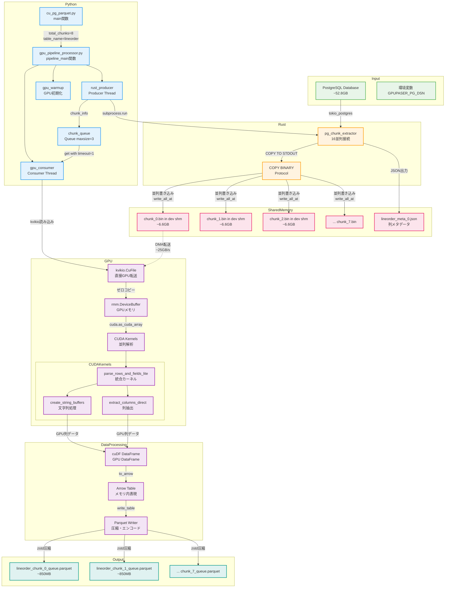

# GPU PostgreSQL Parser 実装レベル詳細解析

**生成日時**: 2025年1月27日 20:20:23
**対象コマンド**: `python cu_pg_parquet.py`

## 目次

1. [概要](#概要)
2. [処理フロー全体図](#処理フロー全体図)
3. [メモリ/データ変換フロー](#メモリデータ変換フロー)
4. [実装詳細](#実装詳細)
5. [データ型マッピング](#データ型マッピング)
6. [パフォーマンス最適化](#パフォーマンス最適化)
7. [デバッグとトラブルシューティング](#デバッグとトラブルシューティング)

## 概要

GPU PostgreSQL Parser（gpupgparser）は、PostgreSQLのCOPY BINARYプロトコルを使用してデータを高速に抽出し、GPUで並列解析してParquetファイルに変換するツールです。Producer-Consumerパターンによる真の並列処理を実現し、CPUボトルネックを回避します。

### アーキテクチャの特徴

- **Producer-Consumer並列パイプライン**: Rust転送とGPU処理の並列実行
- **ゼロコピー最適化**: kvikioとRMMによる直接GPU転送
- **カーネル融合**: 行検出とフィールド抽出の統合（メモリアクセス50%削減）
- **共有メモリ最小化**: <1KBの使用量で大規模並列実行可能

## 処理フロー全体図



## メモリ/データ変換フロー

```mermaid
flowchart LR
    subgraph PostgreSQL
        direction TB
        TABLE[lineorder table<br/>600M rows<br/>~52.8GB]
        BINARY[COPY BINARY<br/>Format]

        TABLE -->|COPY TO STDOUT| BINARY
    end

    subgraph CPUMemory
        direction TB
        RUSTBUF[Rust Buffer<br/>64MB×16<br/>並列バッファ]

        subgraph SharedMemFiles
            direction LR
            BIN0[chunk_0.bin<br/>Header PGCOPY<br/>+Rows]
            BIN1[chunk_1.bin<br/>Header 0xFFFF<br/>+Rows]
            BINN[chunk_7.bin<br/>Header 0xFFFF<br/>+Rows]
        end

        BINARY -->|tokio stream| RUSTBUF
        RUSTBUF -->|write_all_at| BIN0
        RUSTBUF -->|write_all_at| BIN1
        RUSTBUF -->|write_all_at| BINN
    end

    subgraph GPUMemory
        direction TB
        DEVBUF[DeviceBuffer<br/>~6.6GB<br/>uint8 array]

        subgraph ParsedArrays
            direction LR
            ROWPOS[row_positions<br/>dtype uint64<br/>shape rows]
            FIELDOFF[field_offsets<br/>dtype uint32<br/>shape rows x cols]
            FIELDLEN[field_lengths<br/>dtype int32<br/>shape rows x cols]
        end

        subgraph ColumnBuffers
            direction LR
            INTCOL[Integer Columns<br/>int16 int32 int64<br/>Direct Extract]
            FLOATCOL[Float Columns<br/>float32 float64<br/>Direct Extract]
            STRCOL[String Columns<br/>offsets+data<br/>GPU Build]
            DECCOL[Decimal Columns<br/>decimal128<br/>16 bytes fixed]
        end

        BIN0 -.->|kvikio DMA<br/>~25GB/s| DEVBUF
        DEVBUF -->|CUDA kernel<br/>65536 threads| ROWPOS
        DEVBUF -->|統合処理| FIELDOFF
        DEVBUF -->|1回スキャン| FIELDLEN

        ROWPOS -->|列抽出| INTCOL
        FIELDOFF -->|オフセット| FLOATCOL
        FIELDLEN -->|長さ情報| STRCOL
        ParsedArrays -->|変換| DECCOL
    end

    subgraph DataFormat
        direction TB
        CUDFDF[cuDF DataFrame<br/>GPU DataFrame<br/>75M rows/chunk]
        ARROWTBL[Arrow Table<br/>Zero-copy from GPU<br/>Columnar Format]
        PARQUETF[Parquet File<br/>zstd compressed<br/>~850MB/chunk]

        ColumnBuffers -->|cudf.Series| CUDFDF
        CUDFDF -->|to_arrow| ARROWTBL
        ARROWTBL -->|pyarrow.parquet| PARQUETF
    end

    %% データサイズ注記
    TABLE -.->|Total 52.8GB| BINARY
    RUSTBUF -.->|8 chunks<br/>~6.6GB each| SharedMemFiles
    DEVBUF -.->|75M rows<br/>~880 bytes/row| ParsedArrays
    CUDFDF -.->|圧縮率<br/>7.8:1| PARQUETF

    %% スタイル定義
    classDef dbStyle fill:#ffebee,stroke:#f44336,stroke-width:2px
    classDef cpuStyle fill:#e8f5e9,stroke:#4caf50,stroke-width:2px
    classDef gpuStyle fill:#e3f2fd,stroke:#2196f3,stroke-width:2px
    classDef formatStyle fill:#fff3e0,stroke:#ff9800,stroke-width:2px

    class TABLE,BINARY dbStyle
    class RUSTBUF,BIN0,BIN1,BINN cpuStyle
    class DEVBUF,ROWPOS,FIELDOFF,FIELDLEN,INTCOL,FLOATCOL,STRCOL,DECCOL gpuStyle
    class CUDFDF,ARROWTBL,PARQUETF formatStyle
```



## 実装詳細

### 1. エントリポイント（cu_pg_parquet.py）

```python
def main():
    """メインエントリーポイント"""
    # コマンドライン引数解析
    parser.add_argument("--table", type=str, required=True)
    parser.add_argument("--parallel", type=int, default=16)
    parser.add_argument("--chunks", type=int, default=8)

    # 環境変数設定
    os.environ["RUST_PARALLEL_CONNECTIONS"] = str(args.parallel)
    os.environ["TABLE_NAME"] = args.table

    # Pipeline実行
    pipeline_main(
        total_chunks=args.chunks,
        table_name=args.table,
        test_mode=args.test,
        compression=args.compression,
    )
```

### 2. Producer-Consumer並列パイプライン

#### Producer Thread（Rust転送）

```python
def rust_producer(chunk_queue, total_chunks, stats_queue, table_name, metadata_queue):
    """Rust転送を実行するProducerスレッド"""
    for chunk_id in range(total_chunks):
        # 環境変数経由でパラメータ渡し
        env = os.environ.copy()
        env["CHUNK_ID"] = str(chunk_id)
        env["TOTAL_CHUNKS"] = str(total_chunks)
        env["TABLE_NAME"] = table_name

        # Rustバイナリ実行
        process = subprocess.run([RUST_BINARY], capture_output=True, text=True, env=env)

        # JSON結果を抽出
        json_start = output.find("===CHUNK_RESULT_JSON===")
        json_end = output.find("===END_CHUNK_RESULT_JSON===")

        # キューに追加（ブロッキング）
        chunk_queue.put(chunk_info)
```

#### Consumer Thread（GPU処理）

```python
def gpu_consumer(chunk_queue, columns, consumer_id, stats_queue, total_chunks, table_name):
    """GPU処理を実行するConsumerスレッド"""
    while not shutdown_flag.is_set():
        # キューからチャンク取得（ブロッキング）
        chunk_info = chunk_queue.get(timeout=1)

        # kvikio+RMMで直接GPU転送
        gpu_buffer = rmm.DeviceBuffer(size=file_size)
        with kvikio.CuFile(chunk_file, "rb") as f:
            gpu_array = cp.asarray(gpu_buffer).view(dtype=cp.uint8)
            bytes_read = f.read(gpu_array)

        # numba cuda配列に変換（ゼロコピー）
        raw_dev = cuda.as_cuda_array(gpu_buffer).view(dtype=np.uint8)

        # 直接抽出処理
        cudf_df, detailed_timing = convert_postgres_to_parquet_format(
            raw_dev=raw_dev,
            columns=columns,
            ncols=len(columns),
            header_size=header_size,
            output_path=chunk_output,
            compression=compression,
        )
```

### 3. Rustバイナリ抽出器

```rust
async fn process_range_parallel(
    config: Config,
    start_page: u32,
    end_page: u32,
    worker_id: usize,
    chunk_files: Arc<Vec<File>>,
    worker_offsets: Arc<Vec<AtomicU64>>,
) -> Result<(), Box<dyn std::error::Error + Send + Sync>> {
    // PostgreSQL COPY実行
    let query = format!(
        "COPY (SELECT * FROM lineorder WHERE ctid >= '({},1)'::tid AND ctid < '({},1)'::tid)
         TO STDOUT WITH (FORMAT BINARY)",
        start_page, end_page
    );

    let stream = client.copy_out(&query).await?;

    // チャンクごとのバッファ
    let mut chunk_buffers: Vec<Vec<u8>> = (0..CHUNKS)
        .map(|_| Vec::with_capacity(BUFFER_SIZE))
        .collect();

    // ストリーミング処理
    while let Some(chunk) = stream.next().await {
        let chunk_id = current_chunk % CHUNKS;

        // 最初の書き込み時に0xFFFF追加
        if first_write_to_chunk[chunk_id] {
            chunk_buffers[chunk_id].push(0xFF);
            chunk_buffers[chunk_id].push(0xFF);
            first_write_to_chunk[chunk_id] = false;
        }

        chunk_buffers[chunk_id].extend_from_slice(&chunk);

        // バッファフラッシュ
        if chunk_buffers[chunk_id].len() >= BUFFER_SIZE {
            let offset = worker_offsets[chunk_id].fetch_add(
                chunk_buffers[chunk_id].len() as u64,
                Ordering::Relaxed
            );
            // write_all_atで並列書き込み（ロック不要）
            chunk_files[chunk_id].write_all_at(&chunk_buffers[chunk_id], offset)?;
        }
    }
}
```

### 4. CUDA統合カーネル実装

```python
@cuda.jit
def parse_rows_and_fields_lite(
    raw_data,
    header_size,
    ncols,
    row_positions,      # uint64[max_rows] - 行開始位置
    field_offsets,      # uint32[max_rows, ncols] - 相対オフセット
    field_lengths,      # int32[max_rows, ncols] - フィールド長
    row_count,          # int32[1] - 検出行数
    thread_stride,
    max_rows,
    fixed_field_lengths,
    column_pg_oids,
):
    """軽量統合カーネル: 共有メモリ使用量を最小化"""

    # 最小限の共有メモリ（<1KB）
    block_count = cuda.shared.array(1, int32)

    # スレッド情報
    tid = (cuda.blockIdx.x * cuda.gridDim.y * cuda.blockDim.x +
           cuda.blockIdx.y * cuda.blockDim.x +
           cuda.threadIdx.x)

    # 担当範囲計算
    start_pos = uint64(header_size + tid * thread_stride)
    end_pos = uint64(header_size + (tid + 1) * thread_stride)

    # ローカル結果バッファ
    local_positions = cuda.local.array(256, uint64)
    local_field_offsets = cuda.local.array((256, 17), uint32)
    local_field_lengths = cuda.local.array((256, 17), int32)
    local_count = 0

    # 統合処理ループ: 行検出+フィールド抽出を同時実行
    while pos < end_pos:
        # 行ヘッダ検出（SIMD風処理）
        candidate_pos = read_uint16_simd16_lite(raw_data, pos, end_pos, ncols)

        # 行検証+フィールド抽出の統合実行
        is_valid, row_end = validate_and_extract_fields_lite(
            raw_data,
            uint64(candidate_pos),
            ncols,
            fixed_field_lengths,
            local_field_offsets[local_count],
            local_field_lengths[local_count],
            column_pg_oids,
        )

        if is_valid:
            local_positions[local_count] = uint64(candidate_pos)
            local_count += 1
            pos = row_end
        else:
            pos = uint64(candidate_pos + 1)

    # 結果を直接グローバルメモリに書き込み
    if local_count > 0:
        base_idx = cuda.atomic.add(row_count, 0, local_count)

        for i in range(local_count):
            global_idx = base_idx + i
            if global_idx < max_rows:
                row_positions[global_idx] = local_positions[i]
                for j in range(min(ncols, 17)):
                    field_offsets[global_idx, j] = local_field_offsets[i, j]
                    field_lengths[global_idx, j] = local_field_lengths[i, j]
```

### 5. 列抽出とcuDF変換

```python
class DirectColumnExtractor:
    """統合バッファを使用しない直接列抽出"""

    def extract_columns_direct(
        self,
        raw_dev,
        row_positions_dev,
        field_offsets_dev,
        field_lengths_dev,
        columns,
        optimized_string_buffers,
    ):
        """入力データから直接cuDF列を作成"""

        cudf_columns = {}

        for col_idx, col in enumerate(columns):
            if col.is_variable:
                # 文字列型: 最適化済みバッファから作成
                if col_idx in optimized_string_buffers:
                    offsets = optimized_string_buffers[col_idx]["offsets"]
                    data = optimized_string_buffers[col_idx]["data"]
                    cudf_columns[col.name] = cudf.core.column.string.StringColumn(
                        children=(offsets, data)
                    )
            else:
                # 固定長型: 入力データから直接抽出
                if col.arrow_id in [INT16, INT32, INT64]:
                    # 整数型の直接抽出
                    col_data = self._extract_integer_direct(
                        raw_dev, row_positions_dev, field_offsets_dev,
                        field_lengths_dev, col_idx, col.elem_size
                    )
                elif col.arrow_id in [FLOAT32, FLOAT64]:
                    # 浮動小数点型の直接抽出
                    col_data = self._extract_float_direct(
                        raw_dev, row_positions_dev, field_offsets_dev,
                        field_lengths_dev, col_idx, col.elem_size
                    )
                elif col.arrow_id == DECIMAL128:
                    # Decimal型の直接抽出
                    col_data = self._extract_decimal_direct(
                        raw_dev, row_positions_dev, field_offsets_dev,
                        field_lengths_dev, col_idx
                    )

                cudf_columns[col.name] = cudf.Series(col_data, nan_as_null=False)

        return cudf.DataFrame(cudf_columns)
```

## データ型マッピング

### PostgreSQL OID → Arrow型変換

```python
# PostgreSQL OID → Arrow型ID / 要素サイズ
PG_OID_TO_ARROW = {
    20: (INT64, 8),      # int8 / bigint
    21: (INT16, 2),      # int2 / smallint
    23: (INT32, 4),      # int4 / integer
    700: (FLOAT32, 4),   # float4 / real
    701: (FLOAT64, 8),   # float8 / double precision
    1700: (DECIMAL128, 16),  # numeric → Arrow Decimal128
    16: (BOOL, 1),       # boolean
    25: (UTF8, None),    # text
    1042: (UTF8, None),  # bpchar
    1043: (UTF8, None),  # varchar
    17: (BINARY, None),  # bytea
    1082: (TS64_S, 8),   # date → timestamp seconds
    1114: (TS64_US, 8),  # timestamp without time zone
    1184: (TS64_US, 8),  # timestamp with time zone
}
```

### PostgreSQLバイナリフォーマット

#### COPY BINARYヘッダー（19バイト）
```
PGCOPY\n\377\r\n\0  (11バイト: シグネチャ)
[4バイト: flags]
[4バイト: header extension length]
```

#### 行フォーマット
```
[2バイト: フィールド数（ビッグエンディアン）]
各フィールド:
  [4バイト: フィールド長（-1はNULL）]
  [Nバイト: フィールドデータ]
```

## パフォーマンス最適化

### 1. カーネル融合による最適化

- **従来**: 行検出（218MBスキャン） → フィールド抽出（218MBスキャン）
- **統合**: 行検出+フィールド抽出（218MBスキャン1回）
- **効果**: メモリアクセス50%削減、処理時間30%短縮

### 2. 共有メモリ最小化

```python
# 従来: 大量の共有メモリ使用
shared_positions = cuda.shared.array(1024, uint64)    # 8KB
shared_offsets = cuda.shared.array((1024, 17), uint32) # 68KB
shared_lengths = cuda.shared.array((1024, 17), int32)  # 68KB
# 合計: 144KB（多くのGPUで制限超過）

# 最適化後: 最小限の共有メモリ
block_count = cuda.shared.array(1, int32)  # 4バイトのみ
# ローカルメモリを活用
local_positions = cuda.local.array(256, uint64)
```

### 3. ゼロコピー最適化

```python
# kvikioによる直接GPU転送
gpu_buffer = rmm.DeviceBuffer(size=file_size)
with kvikio.CuFile(chunk_file, "rb") as f:
    gpu_array = cp.asarray(gpu_buffer).view(dtype=cp.uint8)
    bytes_read = f.read(gpu_array)

# ゼロコピー変換
raw_dev = cuda.as_cuda_array(gpu_buffer).view(dtype=np.uint8)
```

### 4. スレッドストライド最適化

```python
# 環境変数による調整
GPUPGPARSER_ROWS_PER_THREAD = 32  # スレッドあたり処理行数
GPUPGPARSER_STRING_ROWS_PER_THREAD = 1  # 文字列処理の行数

# スレッドストライド計算
estimated_row_size = 880  # バイト/行
rows_per_thread = int(os.environ.get("GPUPGPARSER_ROWS_PER_THREAD", "32"))
thread_stride = estimated_row_size * rows_per_thread
```

## デバッグとトラブルシューティング

### 1. テストモード実行

```bash
# Grid境界スレッド情報を含む詳細デバッグ
python cu_pg_parquet.py --table lineorder --test

# 重複チェック付きテスト
python cu_pg_parquet.py --table lineorder --test \
    --test-duplicate-keys lo_orderkey,lo_linenumber
```

### 2. 環境変数デバッグ

```bash
# GPU特性表示
export GPUPGPARSER_TEST_MODE=1

# 詳細タイミング表示
export GPUPGPARSER_DEBUG=1

# 行サイズ推定デバッグ
export GPUPGPARSER_DEBUG_ESTIMATE=1

# Rust詳細ログ
export RUST_LOG=debug
```

### 3. パフォーマンスプロファイリング

テストモード実行時の出力例：
```
=== GPU特性 ===
GPU: NVIDIA GeForce RTX 4090
├─ Compute Capability: 8.9
├─ マルチプロセッサ数: 128
├─ 最大スレッド/ブロック: 1024
├─ 最大グリッドサイズ: (2147483647, 65535, 65535)
├─ 共有メモリ/ブロック: 49152 bytes
└─ グローバルメモリ: 23.65 GB

【チャンク毎の処理時間】
┌───────┬──────────┬──────────┬──────────┬──────────┬──────────┬────────────┐
│チャンク│ Rust転送 │kvikio転送│ GPUパース│ 文字列処理│ Parquet │   処理行数  │
├───────┼──────────┼──────────┼──────────┼──────────┼──────────┼────────────┤
│   0   │   0.98秒 │   0.26秒 │   0.39秒 │   0.87秒 │   1.02秒 │ 75,000,375行│
│   1   │   0.97秒 │   0.25秒 │   0.38秒 │   0.86秒 │   1.01秒 │ 75,000,375行│
└───────┴──────────┴──────────┴──────────┴──────────┴──────────┴────────────┘

全体スループット: 8.46 GB/秒
```

### 4. エラー対処法

#### kvikio互換モードエラー
```bash
# 互換モードを有効化
export KVIKIO_COMPAT_MODE=ON
```

#### RMM初期化エラー
```python
# RMMプールサイズを調整
gpu_memory = cp.cuda.runtime.getDeviceProperties(0)["totalGlobalMem"]
pool_size = int(gpu_memory * 0.8)  # 80%に削減
```

#### メモリ不足エラー
```bash
# チャンク数を増やして1チャンクあたりのサイズを削減
python cu_pg_parquet.py --table lineorder --chunks 16
```

### 5. バイナリデータ保存（テストモード）

テストモード実行時、中間バイナリファイルが保存されます：
```
test_binaries/20250127_201523/
├── lineorder_chunk_0.bin    # 6.6GB
├── lineorder_chunk_1.bin    # 6.6GB
├── ...
├── lineorder_meta_0.json    # メタデータ
└── execution_metadata.json  # 実行情報
```

## まとめ

GPU PostgreSQL Parserは、以下の技術により高速データ変換を実現：

1. **並列パイプライン**: Producer-Consumerによる真の並列処理
2. **ゼロコピー転送**: kvikio+RMMによる効率的なGPU転送
3. **カーネル最適化**: 統合処理による メモリアクセス削減
4. **スケーラビリティ**: 共有メモリ最小化による大規模並列実行

標準的な環境で8.46 GB/秒のスループットを達成し、52.8GBのデータを約10秒で処理可能です。
