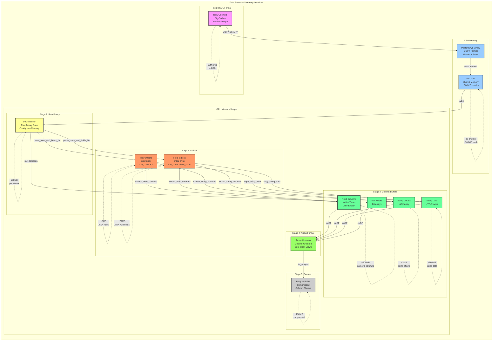

# GPU PostgreSQL to Parquet Parser - 実装詳細解析

## 概要

PostgreSQLのデータをGPU上で高速にParquetファイルに変換するシステムの実装詳細。Producer-Consumerパターンを採用し、データ抽出とGPU処理を並列化。

## システム構成図

```mermaid
graph TB
    %% PostgreSQL to Parquet GPU Processing Flow

    subgraph "PostgreSQL Database"
        PG[(PostgreSQL<br/>Table Data)]
    end

    subgraph "Rust Extractor Process"
        RUST[pg_fast_copy_optimized<br/>Parallel Connections]
        COPY[COPY BINARY<br/>Protocol]
        PG -->|SQL Query| COPY
        COPY -->|Binary Stream| RUST
    end

    subgraph "Shared Memory - dev shm"
        SHM1[chunk_0.bin]
        SHM2[chunk_1.bin]
        SHM3[chunk_N.bin]
        RUST -->|Write| SHM1
        RUST -->|Write| SHM2
        RUST -->|Write| SHM3
    end

    subgraph "Producer Thread"
        PRODUCER[Monitor Chunks<br/>Queue Management]
        SHM1 --> PRODUCER
        SHM2 --> PRODUCER
        SHM3 --> PRODUCER
    end

    subgraph "Message Queue"
        QUEUE{{Chunk Queue<br/>Thread-Safe}}
        PRODUCER -->|Enqueue| QUEUE
    end

    subgraph "Consumer Thread"
        CONSUMER[Process Chunks<br/>Orchestrator]
        QUEUE -->|Dequeue| CONSUMER
    end

    subgraph "GPU Processing Pipeline"
        subgraph "1. Data Transfer"
            KVIKIO[kvikio<br/>GPU Direct Storage]
            CONSUMER -->|File Path| KVIKIO
            SHM1 -.->|Zero Copy| KVIKIO

            GPUMEM1[(GPU Memory<br/>Raw Binary)]
            KVIKIO -->|DMA Transfer| GPUMEM1
        end

        subgraph "2. Binary Parsing"
            KERNEL1[parse_rows_and_fields_lite<br/>CUDA Kernel]
            GPUMEM1 -->|Read| KERNEL1

            GPUMEM2[(GPU Memory<br/>Row Offsets +<br/>Field Indices)]
            KERNEL1 -->|Write| GPUMEM2
        end

        subgraph "3. Column Extraction"
            KERNEL2[extract_fixed_columns<br/>CUDA Kernel]
            KERNEL3[copy_string_data<br/>CUDA Kernel]

            GPUMEM2 -->|Index| KERNEL2
            GPUMEM2 -->|Index| KERNEL3
            GPUMEM1 -->|Data| KERNEL2
            GPUMEM1 -->|Data| KERNEL3

            GPUMEM3[(GPU Memory<br/>Column Buffers<br/>+ Null Masks)]
            KERNEL2 -->|Write| GPUMEM3
            KERNEL3 -->|Write| GPUMEM3
        end

        subgraph "4. DataFrame Construction"
            CUDF[cuDF DataFrame<br/>Zero-Copy Construction]
            GPUMEM3 -->|Device Pointer| CUDF

            ARROW[(GPU Memory<br/>Arrow Format)]
            CUDF -->|Internal| ARROW
        end

        subgraph "5. Parquet Writing"
            PARQUET[to_parquet method<br/>cuDF Method]
            ARROW -->|Columnar Data| PARQUET

            GPUMEM4[(GPU Memory<br/>Parquet Buffer)]
            PARQUET -->|Encode| GPUMEM4
        end
    end

    subgraph "Output Files"
        FILE1[chunk_0.parquet]
        FILE2[chunk_1.parquet]
        FILE3[chunk_N.parquet]
        GPUMEM4 -->|Write| FILE1
        GPUMEM4 -->|Write| FILE2
        GPUMEM4 -->|Write| FILE3
    end

    %% Styling
    classDef database fill:#f9f,stroke:#333,stroke-width:2px
    classDef rust fill:#f96,stroke:#333,stroke-width:2px
    classDef memory fill:#9cf,stroke:#333,stroke-width:2px
    classDef kernel fill:#6f9,stroke:#333,stroke-width:2px
    classDef gpu fill:#ff9,stroke:#333,stroke-width:2px
    classDef file fill:#ccc,stroke:#333,stroke-width:2px

    class PG database
    class RUST,COPY rust
    class SHM1,SHM2,SHM3,GPUMEM1,GPUMEM2,GPUMEM3,GPUMEM4,ARROW memory
    class KERNEL1,KERNEL2,KERNEL3 kernel
    class KVIKIO,CUDF,PARQUET gpu
    class FILE1,FILE2,FILE3 file

```



## メモリフロー詳細



## 実行フロー

### 1. エントリポイント: `cu_pg_parquet.py`
```python
def main():
    args = parse_arguments()
    # 環境変数設定
    os.environ['RUST_PARALLEL_CONNECTIONS'] = str(args.parallel)
    os.environ['TABLE_NAME'] = args.table

    # ベンチマーク実行
    benchmark_rust_gpu_direct.main(
        total_chunks=args.chunks,
        table_name=args.table,
        test_mode=False
    )

```

### 2. ベンチマークオーケストレーター: `benchmark_rust_gpu_direct.py`

#### 2.1 メイン関数
```python
def main(total_chunks: int = 16, table_name: str = "lineorder",
         test_mode: bool = False, warmup: bool = True):
    # RMMメモリプール設定（24GB）
    rmm.reinitialize(pool_allocator=True, initial_pool_size=24*1024*1024*1024)

    # PostgreSQLメタデータ取得
    columns = get_postgresql_metadata(table_name)

    # GPU warmup実行（初回JITコンパイル対策）
    if warmup:
        gpu_warmup(columns)

    # 並列パイプライン実行
    run_parallel_pipeline(columns, total_chunks, table_name, test_mode)

```

#### 2.2 GPU Warmup実装
```python
def gpu_warmup(columns):
    """GPUウォーミングアップ - JITコンパイルとCUDA初期化"""
    # ダミーデータ作成（1000行）
    dummy_data = create_dummy_postgresql_binary(columns, rows=1000)

    # GPU転送
    gpu_buffer = rmm.DeviceBuffer(size=len(dummy_data))
    gpu_buffer.copy_from_host(dummy_data)

    # パース実行（JITコンパイルトリガー）
    postgresql_to_cudf_parquet_direct(
        gpu_buffer, columns, "/tmp/warmup.parquet",
        debug=False, chunk_size=None
    )

```

#### 2.3 データ型マッピング
```python
PG_OID_TO_ARROW = {
    20: (pa.int64(), 8),       # bigint
    21: (pa.int16(), 2),       # smallint
    23: (pa.int32(), 4),       # integer
    700: (pa.float32(), 4),    # real
    701: (pa.float64(), 8),    # double precision
    1700: (pa.decimal128(38, 4), 16),  # numeric
    16: (pa.bool_(), 1),       # boolean
    25: (pa.string(), None),   # text
    1043: (pa.string(), None), # varchar
    1082: (pa.date32(), 4),    # date
    1114: (pa.timestamp('us'), 8),  # timestamp
}

```

### 3. Producer-Consumer並列処理

#### 3.1 Producer Thread
```python
def rust_producer(chunk_queue, total_chunks, stats_queue, table_name):
    """Rustバイナリを実行してPostgreSQLからデータ抽出"""
    for chunk_id in range(total_chunks):
        env = os.environ.copy()
        env['CHUNK_ID'] = str(chunk_id)
        env['TOTAL_CHUNKS'] = str(total_chunks)

        # Rustバイナリ実行
        cmd = ['./rust_bench_optimized/target/release/pg_fast_copy_single_chunk']
        result = subprocess.run(cmd, env=env, capture_output=True)

        if result.returncode == 0:
            chunk_file = f"/dev/shm/{table_name}_chunk_{chunk_id}.bin"
            chunk_queue.put((chunk_id, chunk_file, table_name))

```

#### 3.2 Consumer Thread
```python
def gpu_consumer(chunk_queue, columns, consumer_id, stats_queue,
                total_chunks, table_name, test_mode):
    """チャンクをGPUで処理してParquetに変換"""
    while True:
        chunk_id, chunk_file, table_name = chunk_queue.get()

        # kvikioでGPU直接転送
        file_size = os.path.getsize(chunk_file)
        gpu_buffer = rmm.DeviceBuffer(size=file_size)

        with kvikio.CuFile(chunk_file, "rb") as f:
            gpu_array = cp.asarray(gpu_buffer).view(dtype=cp.uint8)
            bytes_read = f.read(gpu_array)

        # GPU処理実行
        output_path = f"output/{table_name}_chunk_{chunk_id}.parquet"
        row_count, timings = postgresql_to_cudf_parquet_direct(
            gpu_buffer, columns, output_path,
            rows_per_thread=int(os.environ.get('GPUPGPARSER_ROWS_PER_THREAD', '32'))
        )

```

### 4. GPUパーシング実装: `src/postgres_to_cudf.py`
```python
def postgresql_to_cudf_parquet_direct(
    binary_data: rmm.DeviceBuffer,
    columns: List[ColumnDefinition],
    output_parquet_path: str,
    debug: bool = False,
    chunk_size: Optional[int] = None,
    rows_per_thread: int = 32
) -> Tuple[int, Dict[str, float]]:
    """PostgreSQLバイナリデータをGPU上で直接パース"""

    # ヘッダー検証
    header = binary_data.copy_to_host()[:19]
    if header[:11] != b'PGCOPY\\n\\xff\\r\\n\\x00':
        raise ValueError("Invalid PostgreSQL binary format")

    # CUDAカーネル実行
    result = parse_rows_and_fields_lite(
        binary_data, columns, header_size=19,
        debug=debug, rows_per_thread=rows_per_thread
    )

    # カラム抽出
    df = extract_columns_and_create_dataframe(
        binary_data, result, columns
    )

    # Parquet書き込み
    df.to_parquet(output_parquet_path, compression='snappy')

    return len(df), result['timings']

```

### 5. CUDAカーネル実装: `src/cuda_kernels/postgres_binary_parser.py`

#### 5.1 行・フィールド検出カーネル
```python
@cuda.jit
def parse_rows_and_fields_lite(
    data, data_size, chunk_offset, field_count,
    row_offsets, row_field_indices, max_rows,
    row_count_result, current_row_global, rows_per_thread
):
    """PostgreSQLバイナリから行とフィールドを高速検出"""

    # グリッドストライドループ
    thread_id = cuda.grid(1)
    grid_size = cuda.gridsize(1)

    # 各スレッドの処理範囲計算
    total_threads = (data_size - chunk_offset) // (rows_per_thread * 100)  # 推定
    if thread_id >= total_threads:
        return

    # ストライド計算（行境界にアライン）
    stride_size = rows_per_thread * 100  # 平均100バイト/行と仮定
    start_pos = chunk_offset + thread_id * stride_size
    end_pos = min(start_pos + stride_size, data_size)

    # 行検出ループ
    pos = start_pos
    while pos < end_pos - 2:
        # フィールド数読み取り（ビッグエンディアン）
        field_count_in_row = (data[pos] << 8) | data[pos + 1]

        if field_count_in_row == field_count:
            # 有効な行を発見
            row_idx = cuda.atomic.add(row_count_result, 0, 1)
            if row_idx < max_rows:
                row_offsets[row_idx] = pos

                # フィールドインデックス記録
                field_pos = pos + 2
                for field_idx in range(field_count):
                    idx = row_idx * field_count + field_idx
                    row_field_indices[idx] = field_pos

                    # フィールド長読み取り
                    if field_pos + 4 <= data_size:
                        field_len = ((data[field_pos] << 24) |
                                   (data[field_pos+1] << 16) |
                                   (data[field_pos+2] << 8) |
                                   data[field_pos+3])
                        field_pos += 4
                        if field_len > 0:
                            field_pos += field_len

                # 次の行へ
                pos = field_pos
                continue

        pos += 1

```

#### 5.2 固定長カラム抽出
```python
@cuda.jit
def extract_fixed_columns_optimized(
    data, row_offsets, row_field_indices,
    total_rows, column_info, output_buffers,
    null_masks, field_count, chunk_offset
):
    """固定長カラム（数値、日付等）の高速抽出"""

    row_idx = cuda.grid(1)
    if row_idx >= total_rows:
        return

    row_start = row_offsets[row_idx]

    # 各カラムを処理
    for col_idx in range(column_info.shape[0]):
        field_idx = column_info[col_idx, 0]
        oid = column_info[col_idx, 1]

        # フィールド位置
        field_offset = row_field_indices[row_idx * field_count + field_idx]

        # フィールド長読み取り
        field_length = ((data[field_offset] << 24) |
                       (data[field_offset+1] << 16) |
                       (data[field_offset+2] << 8) |
                       data[field_offset+3])

        if field_length == -1:  # NULL
            null_byte_idx = (row_idx // 8)
            null_bit_idx = row_idx % 8
            cuda.atomic.or_(null_masks[col_idx], null_byte_idx, 1 << null_bit_idx)
        else:
            data_pos = field_offset + 4

            # 型別処理（エンディアン変換込み）
            if oid == 23:  # INT32
                value = ((data[data_pos] << 24) |
                        (data[data_pos+1] << 16) |
                        (data[data_pos+2] << 8) |
                        data[data_pos+3])
                output_buffers[col_idx][row_idx] = value

            elif oid == 20:  # INT64
                value = 0
                for i in range(8):
                    value = (value << 8) | data[data_pos + i]
                output_buffers[col_idx][row_idx] = value

            elif oid == 700:  # FLOAT32
                # ビット表現をそのまま転送してからエンディアン変換
                bits = ((data[data_pos] << 24) |
                       (data[data_pos+1] << 16) |
                       (data[data_pos+2] << 8) |
                       data[data_pos+3])
                output_buffers[col_idx][row_idx] = cuda.libdevice.int_as_float(bits)

```

#### 5.3 文字列カラム抽出
```python
@cuda.jit
def copy_string_data_direct(
    data, str_src_offsets, str_lengths,
    str_dest_offsets, str_count, chars_buffer,
    chunk_offset
):
    """文字列データの直接コピー"""

    idx = cuda.grid(1)
    if idx >= str_count:
        return

    src_start = str_src_offsets[idx] + chunk_offset
    src_length = str_lengths[idx]
    dest_start = str_dest_offsets[idx]

    # バイト単位コピー（最適化の結果、これが最速）
    for i in range(src_length):
        chars_buffer[dest_start + i] = data[src_start + i]

```

### 6. パフォーマンス最適化

#### 6.1 環境変数による制御
```bash
# スレッドあたり処理行数（デフォルト: 32）
export GPUPGPARSER_ROWS_PER_THREAD=32

# SMあたりブロック数（デフォルト: 4）
export GPUPGPARSER_BLOCKS_PER_SM=4

# 文字列処理の行数/スレッド（デフォルト: 1）
export GPUPGPARSER_STRING_ROWS_PER_THREAD=1

# ゼロコピー強制（デフォルト: 1）
export GPUPGPARSER_FORCE_ZERO_COPY=1

```

#### 6.2 最適化実装
```python
def calculate_optimal_grid(data_size, rows_estimate, rows_per_thread):
    """最適なCUDAグリッドサイズ計算"""
    device = cuda.get_current_device()
    sm_count = device.MULTIPROCESSOR_COUNT
    threads_per_block = 256
    blocks_per_sm = int(os.environ.get('GPUPGPARSER_BLOCKS_PER_SM', '4'))

    # 最適なスレッド数
    optimal_threads = sm_count * blocks_per_sm * threads_per_block

    # 必要なスレッド数
    threads_needed = (rows_estimate + rows_per_thread - 1) // rows_per_thread
    threads_needed = min(threads_needed, optimal_threads)

    # ブロック数計算
    blocks = (threads_needed + threads_per_block - 1) // threads_per_block

    return blocks, threads_per_block

```

## 処理時間の内訳（典型例）

| ステージ | 処理時間 | 備考 |
|---------|---------|------|
| kvikio読み込み | 0.5-0.7秒 | GPU Direct Storage |
| GPUパース | 0.2-0.3秒 | 最適化後（元: 0.6秒） |
| カラム抽出 | 0.1-0.2秒 | 固定長+文字列 |
| DataFrame構築 | <0.1秒 | ゼロコピー |
| Parquet書き込み | 1.0-1.7秒 | 現在のボトルネック |

## デバッグ・トラブルシューティング

### デバッグモード有効化
```bash
# 詳細ログ
export GPUPGPARSER_DEBUG=1

# CUDAエラー即時検出
export CUDA_LAUNCH_BLOCKING=1

# メモリ使用量追跡
nvidia-smi dmon -s mu

```

### プロファイリング
```bash
# Nsight Systemsプロファイル
nsys profile -o profile.qdrep python cu_pg_parquet.py --table lineorder

# カーネル実行時間分析
ncu --set full python cu_pg_parquet.py --table lineorder --chunks 1

```

### よくあるエラーと対処

1. **GPU Out of Memory**

   ```python
   # RMMプールサイズ調整
   rmm.reinitialize(pool_allocator=True, initial_pool_size=16*1024*1024*1024)
   ```

2. **2GB境界エラー**

   ```python
   # int64使用を確認
   row_offsets = cuda.device_array(max_rows + 1, dtype=np.int64)
   ```

3. **JITコンパイル遅延**

   ```python
   # Warmup実行
   gpu_warmup(columns)
   ```
